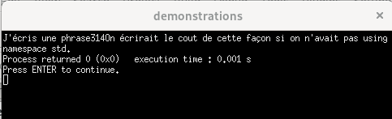
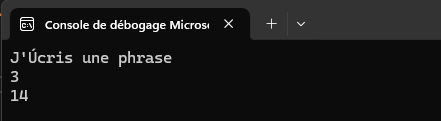
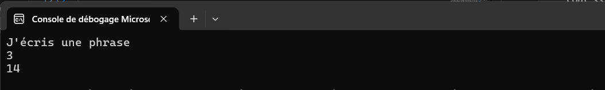

# Écriture du premier programme

Il faut que l'installation de Visual Studio 2022 soit complétée ou bien que vous utilisiez les ordinateurs de l'école.

# Étapes à suivre (programme Hello World)

1. **Ouvrir Visual Studio.**

2. **Créer un nouveau projet qu'on appellera Hello_World** 
    
    - Fichier, nouveau: <br>
<br>
    - Choisir un projet vide: <br>
<br>
    - Appuyer sur Suivant <br>
    - Nommer le projet: <br>
 <br>
    - Appuyer sur Créer<br>


3. **Créer un fichier source dans lequel on va écrire le code**

    - Nouvel élément en faisant clic droit, Ajouter, Nouvel élément <br>
<br>
    - Lui donner un nom. Ici, HelloWorld.cpp <br>


4. **Écrire du code**

    - Le code s'écrit dans la fenêtre vide quand on choisit l'onglet de notre fichier source: <br>
<br>
    - Écrivez le code ci-dessous dans la zone d'écriture: <br>
```cpp
#include <iostream>
using namespace std;
int main(){
    cout <<"Salut le monde!";
    return 0;
}
``` 

- Portez attention aux symboles utilisés! Un guillemet double n'est pas équivalent à un apostrophe ni à un guillemet 'back-ticks (`)'.
- Pour connaître l'emplacement de vos touches de clavier, cherchez "clavier visuel" dans le menu démarrer de Windows.


 <br>

- On peut voir les guillemets double en gris pâle, cela signifie qu'on doit peser sur Maj (shift) pour y accéder. <br>
 <br>


5. Vérifier si ça marche!

    - Peser sur Débogueur Windows local <br>
<br>


    - Une console devrait apparaître et vous montrer le résultat: <br>
<br>


Voilà! Un programme très simple vient d'être créé, compilé et exécuté.

# Comment ça marche?
Pour que ce mini programme fonctionne, 
- On a utilisé un **éditeur de texte** pour saisir le code.
- On a compilé le code: un **compilateur C++** a traduit votre code en langage machine et a vérifié s'il y avait des erreurs de syntaxe (il les signale s'il en trouve).
- Le compilateur C++ a ensuite créé un **fichier exécutable**.
- L'exécutable est lancé: il lit les instruction en ordre **de haut en bas** et exécute ce qu'il y a dans la **fonction main()**.

# Commandes de base

## Le "cout"

 - Cette commande se lit c-out (pour console output). 
 - Elle est suivie des symboles >> et d'une expression (texte ou mathématique).
 - Pour fonctionner, il doit y avoir les commandes ci-dessous placées en début de fichier. 

 ```cpp
#include <iostream>
using namespace std;
```

- La commande doit également être placée dans un main() ou une fonction (on verra les fonctions plus tard). Le main() est obligatoirement suivi des () et d'une paire d'accolades { }. Par convention, on peut placer les accolades comme ceci:

 ```cpp
#include <iostream>
using namespace std;
int main(){
   
    return 0;
}
```

ou comme ceci:

 ```cpp
#include <iostream>
using namespace std;
int main()
{
   
    return 0;
}
```

L'important est que le code qu'on souhaite exécuter soit placé entre le début et la fin des accolades. On reviendra plus tard sur la raison des mots-clés "int" et "return 0". 
- On peut y mettre du texte entre guillemets doubles "" ou des nombres sans guillemets.


 ```cpp
#include <iostream>
using namespace std;
int main(){
    cout <<"J'écris une phrase";
    cout << 3;
    cout << 8+6;
    return 0;
}
```

- On obtient ceci dans la console:<br>
<br>

- On peut écrire faire faire un retour de ligne (endl) pour que ça soit plus lisible. On doit entrecouper les divers **types** de données par l'opérateur d'insertion (<<).

 ```cpp
#include <iostream>
using namespace std;
int main(){
    cout <<"J'écris une phrase" << endl;
    cout << 3 << endl;
    cout << 8+6 << endl;
    return 0;
}
```

- C'est déjà mieux! On voit aussi que le calcul a été effectué (6+8)<br>
<br>


- Pour que les accents de la langue française apparaissent, on ajoute quelques ligne de code à des endroits précis:

 ```cpp
#include <iostream>
#include <locale.h>

using namespace std;
int main() {
    setlocale(LC_ALL, "");
    cout << "J'écris une phrase"<< endl;
    cout << 3 << endl;
    cout << 8 + 6 << endl;
    return 0;
}
```

<br>


## Les commentaires

Quand on souhaite qu'une ligne ou des bouts de lignes soient ignorés lors de l'exécution des commandes, on peut les mettre en commentaire. On peut mettre les 2 barres obliques devant n'importe quel ligne de texte, ça devient vert et ça ne sera pas lu à l'exécution. Les erreurs de syntaxes seront ignorées dans les commentaires.

```cpp
// ceci est un commentaire
/** ce bloc est en commentaire
*
* J'ai pensé laissé des notes ici pour me rappeler de mon raisonnement lors de la création du code.
* C'est une norme demandée très souvent en entreprise, ça facilite le travail d'équipe.
*
**/

```

## Les expressions mathématiques de base

Les expression mathématiques sont les mêmes que vous avez déjà vues!

| Symbole | Explication                     |
|---------|---------------------------------|
| `+`     | Addition                        |
| `-`     | Soustraction                    |
| `*`     | Multiplication                  |
| `/`     | Division                        |
| `%`     | Modulo                          |

Pour faire un exposant, il faut faire ceci:

```cpp
// pour faire 8 exposant 2:
cout << pow(8,2);
```


# Erreurs de syntaxe

- TOUS les programmeurs font des erreurs, peu importe leur niveau d'expérience. Heureusement, les erreurs de syntaxe sont de plus en plus faciles à trouver, puisque le compilateur nous avertit lorsqu'il en trouve et nous les pointe.

- Il sera **primordial** de développer votre autonomie à repérer et corriger les erreurs petit à petit durant la formation. Il n'y aura pas toujours quelqu'un par dessus votre épaule! 

- Faisons une erreur de syntaxe fréquente: oublier un point-virgule (;)

```cpp
#include <iostream>
using namespace std;
int main(){
    cout <<"Salut le monde!" 
    return 0;
}
```
- On a déjà un avertissement qui apparaît avant de faire play: <br>
<br>

- Le mot return est souligné en rouge. Si on place notre curseur sur le mot en rouge, on a souvent de bons indices:<br>

<br>

- Si on ignore le souligné et qu'on fait play (Débugueur Windows local), on aura un message tel que celui-ci:<br>

<br>

- en faisant NON, on aura une liste d'erreurs qui se présentera dans la section en bas:<br>

<br>

- Il est indiqué qu'il faut un ; avant le return. On apprendra rapidement qu'il faut le mettre à la fin de la ligne précédent, donc à la fin de la ligne 4. 
- Considérer cela comme un OUTIL d'aide et non comme une vérité absolue. Vos yeux et votre expérience vont souvent vous être plus utiles!
