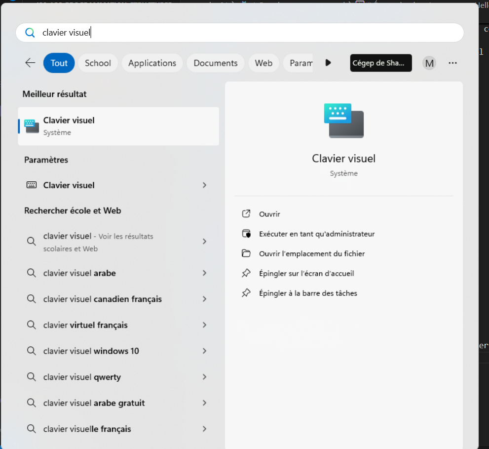
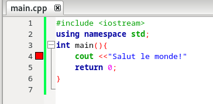
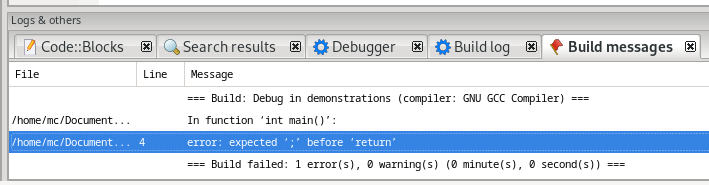
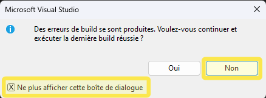

# Écriture du premier programme

Il faut que l'installation de Visual Studio 2022 soit complétée ou bien que vous utilisiez les ordinateurs de l'école.

# Étapes à suivre (programme Hello World)

1. Ouvrir Visual Studio.

2. Créer un nouveau projet qu'on appellera Hello_World 
    
    - Fichier, nouveau:


    - Choisir un projet vide:


    - Appuyer sur Suivant

    - Nommer le projet:
    


    - Appuyer sur Créer


3. Créer un fichier source dans lequel on va écrire le code
<br><br>
- Nouvel élément en faisant clic droit, Ajouter, Nouvel élément

- Lui donner un nom. Ici, HelloWorld.cpp


<br><br>
4. Écrire du code

Le code s'écrit dans la fenêtre vide quand on choisit l'onglet de notre fichier source: 


Écrire le code ci-dessous dans la zone d'écriture:
```cpp
#include <iostream>
using namespace std;
int main(){
    cout <<"Salut le monde!";
    return 0;
}
```
- Portez attention aux symboles utilisés! Un guillemet double n'est pas équivalent à un apostrophe ni à un guillemet 'back-ticks (`)'.
- Pour connaître l'emplacement de vos touches de clavier, chercher "clavier visuel" dans le menu démarrer de Windows.



<br><br>
On peut voir les guillemets double en gris pâle, cela signifie qu'on doit peser sur Maj (shift) pour y accéder. 


<br><br>
5. Vérifier si ça marche!

- Peser sur Débogueur Windows local


<br><br>
- Une console devrait apparaître et vous montrer le résultat:


Voilà! Le programme le plus simple vient d'être créé, compilé et exécuté.

# Comment ça marche?
Pour que ce mini programme fonctionne, 
- on a utilisé un **éditeur de texte** pour saisir le code.
- On a compilé le code: un compilateur C++ a traduit votre code en langage machine et a vérifié s'il y avait des erreurs de syntaxe (il les signale s'il en trouve).
- Le compilateur C++ a ensuite créé un  fichier exécutable.
- L'exécutable est lancé: il lit les instruction en ordre de haut en bas et exécute ce qu'il y a dans la **fonction main()**.

# Commandes de base

## le "cout"

 - Cette commande se lit c-out (pour console output). 
 - Elle est suivie des symboles >> et d'une expression (texte ou mathématique).
 - Pour fonctionner, il doit y avoir les commandes ci-dessous placées en début de fichier. 
 ```cpp
#include <iostream>
using namespace std;
```
- La commande doit également être placée dans un main() ou une fonction (on verra les fonctions plus tard). Le main() est obligatoirement suivi des () et d'une paire d'accolades {}. Par convention, on peut placer les accolades comme ceci:
 ```cpp
#include <iostream>
using namespace std;
int main(){
   
    return 0;
}
```

ou comme ceci:

 ```cpp
#include <iostream>
int main()
{
   
    return 0;
}
```
L'important est que le code qu'on souhaite exécuter soit placé entre le début et la fin des accolades. On reviendra plus tard sur la raison des mots-clés "int" et "return 0". 
- On peut y mettre du texte entre guillemets doubles "" ou des nombres sans guillemets.


 ```cpp
#include <iostream>
using namespace std;
int main(){
    cout <<"J'écris une phrase";
    cout << 3;
    cout << 8+6;
    return 0;
}
```
- On peut écrire faire faire un retour de ligne pour que ça soit plus lisible.

//TODO 


# Erreurs de syntaxe

- TOUS les programmeurs font des erreurs, peu importe leur niveau d'expérience. Heureusement, les erreurs de syntaxe sont de plus en plus faciles à trouver, puisque le compilateur nous avertit lorsqu'il en trouver et nous les pointe.

- Il sera **primordial** de développer votre autonomie à repérer et corriger les erreurs durant la formation. Il n'y aura pas toujours quelqu'un par dessus votre épaule! 

- Faisons une erreur de syntaxe fréquente: oublier un ;

```cpp
#include <iostream>
using namespace std;
int main(){
    cout <<"Salut le monde!" 
    return 0;
}
```
- On a déjà un avertissement qui apparaît avant de faire play: 


- Le mot return est souligné en rouge. Si on place notre curseur sur le mot en rouge, on a souvent de bons indices:



- Si on ignore le souligné et qu'on fait play (Débugueur Windows local), on aura un message tel que celui-ci:



- en faisant NON, on aura une liste d'erreurs qui se présentera dans la section en bas:


- Il est indiqué qu'il faut un ; avant le return. On apprendra rapidement qu'il faut le mettre à la fin de la ligne précédent, donc à la fin de la ligne 4. 
- Considérer la console comme un OUTIL d'aide et non comme une vérité absolue.
