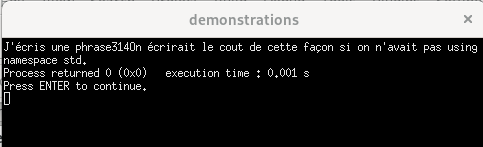
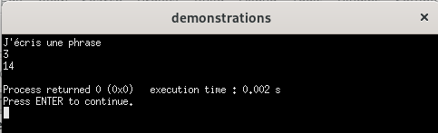

# Écriture du premier programme


1. **Écrire du code**

Lorsqu'on a créé un nouveau projet, on a automatiquement un main.cpp qui est inclut. On a du code comme celui-ci:

```cpp
#include <iostream>
using namespace std;
int main(){
    cout <<"Hello World!";
    return 0;
}
``` 

- Portez attention aux symboles utilisés! Un guillemet double n'est pas équivalent à un apostrophe ni à un guillemet 'back-ticks (`)'.


2. Vérifier si ça marche!

    - Peser sur Build and run OU sur la touche **F9** <br>


Voilà! Un programme très simple vient d'être créé, compilé et exécuté. Après chaque changement, il faut absolument faire un nouveau Build (qui se fait quand on fait build and run) pour que les modifications soient prises en compte.


# Commandes de base

## Le "cout"

 - Cette commande se lit c-out (pour console output). 
 - Elle est suivie des symboles << et d'une expression (texte ou mathématique).
 - Cet objet fait partie de la bibliothèque <iostream>, qu'on inclut au début de nos programmes avec l'indication #include. Cout fait partie d'un espace de noms de la bibliothèque standard de c++, std. Pour éviter d'avoir à écrire la spécification qu'on veut avoir la commande std::cout, on ajoute le nom du namespace qui sera sous-entendu devant chaque utilisation de cout.
 ```cpp
#include <iostream>
using namespace std;
```

- La commande doit également être placée dans un main() ou une fonction (on verra les fonctions plus tard). Le main() est obligatoirement suivi des () et d'une paire d'accolades { }. Par convention, on peut placer les accolades comme ceci:

 ```cpp
#include <iostream>
using namespace std;
int main(){
   
    return 0;
}
```

ou comme ceci:

 ```cpp
#include <iostream>
using namespace std;
int main()
{
   
    return 0;
}
```

L'important est que le code qu'on souhaite exécuter soit placé entre le début et la fin des accolades. On reviendra plus tard sur la raison des mots-clés "int" et "return 0". 
- On peut y mettre du texte entre guillemets doubles "" ou des nombres sans guillemets.


 ```cpp
#include <iostream>
using namespace std;
int main(){
    cout <<"J'écris une phrase";
    cout << 3;
    cout << 8+6;
    std::cout << "On écrirait le cout de cette façon si on n'avait pas using namespace std.";
    return 0;
}
```


- On obtient ceci dans la console:<br>
<br>

- On peut écrire faire faire un retour de ligne (endl) pour que ça soit plus lisible. On doit entrecouper les divers **types** de données par l'opérateur d'insertion (<<).

 ```cpp
#include <iostream>
using namespace std;
int main(){
    cout <<"J'écris une phrase" << endl;
    cout << 3 << endl;
    cout << 8+6 << endl;
    return 0;
}
```

- C'est déjà mieux! On voit aussi que le calcul a été effectué (6+8)<br>
<br>


> Pour que les accents de la langue française apparaissent sous Windows, on ajoute quelques lignes de code à des endroits précis:

 ```cpp
#include <iostream>
#include <locale.h>

using namespace std;
int main() {
    setlocale(LC_ALL, "");
    cout << "J'écris une phrase"<< endl;
    cout << 3 << endl;
    cout << 8 + 6 << endl;
    return 0;
}
```


## Les commentaires

Quand on souhaite qu'une ligne ou des bouts de lignes soient ignorés lors de l'exécution des commandes, on peut les mettre en commentaire. On peut mettre les 2 barres obliques devant n'importe quelle ligne de texte, ça devient vert et ça ne sera pas lu à l'exécution. Les erreurs de syntaxe seront ignorées dans les commentaires.

```cpp
// ceci est un commentaire
/** ce bloc est en commentaire
*
* J'ai pensé laisser des notes ici pour me rappeler de mon raisonnement lors de la création du code.
* C'est une norme demandée très souvent en entreprise, ça facilite le travail d'équipe.
*
**/

```

## Les expressions mathématiques de base

Les expression mathématiques sont les mêmes que vous avez déjà vues!

| Symbole | Explication                     |
|---------|---------------------------------|
| `+`     | Addition                        |
| `-`     | Soustraction                    |
| `*`     | Multiplication                  |
| `/`     | Division                        |
| `%`     | Modulo                          |

Pour faire un exposant, il faut inclure une librairie de mathématique d'abord:

```cpp
#include <cmath>
```

```cpp
// pour faire 8 exposant 2:
cout << pow(8,2);
```


# Erreurs de syntaxe

- TOUS les programmeurs font des erreurs, peu importe leur niveau d'expérience. Heureusement, les erreurs de syntaxe sont de plus en plus faciles à trouver, puisque le compilateur nous avertit lorsqu'il en trouve et nous les pointe.

- Il sera **primordial** de développer votre autonomie à repérer et corriger les erreurs petit à petit durant la formation. Il n'y aura pas toujours quelqu'un par dessus votre épaule! 

- Faisons une erreur de syntaxe fréquente: oublier un point-virgule (;)

```cpp
#include <iostream>
using namespace std;
int main(){
    cout <<"Salut le monde!" 
    return 0;
}
```
- On un carré rouge qui apparaît à la ligne où se trouve l'erreur: <br>
<br>

- L'explication du carré rouge est dans l'onglet build message'<br>

<br>


- Considérer cela comme un OUTIL d'aide et non comme une vérité absolue. Vos yeux et votre expérience (qu'il faut acquérir en pratiquant) vont souvent vous être plus utiles!


## Comment ça marche?

Que se passe-t-il quand on clique sur Build and Run dans Code::Blocks avec GCC ?

1. Édition du code

    - On écrit notre programme dans l’éditeur de code de Code::Blocks.

2. Compilation

    - Le compilateur GCC traduit le code C++ en langage machine que l’ordinateur comprend.
    - Il vérifie aussi s’il y a des erreurs de syntaxe (mots mal écrits, symboles manquants, etc.) et les signale.

3. Création de l’exécutable

    - Si aucune erreur bloquante n’est trouvée, GCC crée un fichier exécutable (.exe sous Windows, fichier binaire sans extension sous Linux).

4. Exécution

    - Code::Blocks lance l’exécutable.
    - Le programme lit les instructions de haut en bas dans le fichier.
    - L’exécution commence toujours dans la fonction main(), puis suit l’ordre du code.


## Fichiers du projet

Selon le système d'exploitation sur lequel on se trouve, l'éditeur ne change pas, mais le contenu des dossiers change un peu. 

En Windows:


En Linux:


Dans les 2 cas, c'est dans le ou les fichiers .cpp qu'on peut écrire du code. On pourra transporter ce fichier et le rouler dans n'importe quel éditeur qui permet de compiler du C++.

| Étape                          | Windows (GCC)                                     | Linux (GCC)                            |
| ------------------------------ | ------------------------------------------------- | -------------------------------------- |
| **Nom par défaut**             | `a.exe`                                           | `a.out`                                |
| **Extension**                  | `.exe` (obligatoire pour les exécutables Windows) | aucune extension (exécutable binaire)  |
| **Format du fichier**          | PE (*Portable Executable*)                        | ELF (*Executable and Linkable Format*) |
| **Exécution dans terminal**    | `a.exe` ou double-clic                            | `./a.out`                              |
| **Nom personnalisé**           | `g++ moncode.cpp -o monprogramme.exe`             | `g++ moncode.cpp -o monprogramme`      |
| **Exécution nom personnalisé** | `monprogramme.exe`                                | `./monprogramme`                       |
