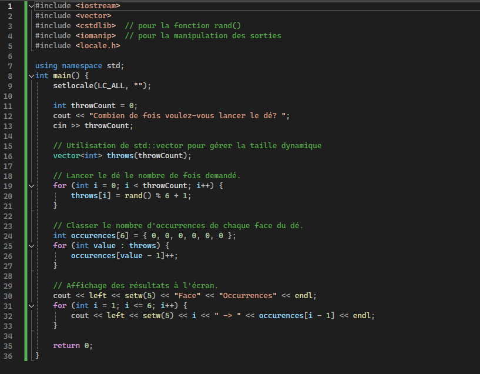

# Exercices (intro)

# Préambule
Préambule: Pour éviter d'avoir à effacer ou commenter des parties de codes en exercice, voici une manière simple et efficace d'activer et désactiver l'exécution de code. Le détail de l'utilisation des fonctions sera vu dans quelques semaines.

```cpp
#include <iostream>
#include <locale.h>

using namespace std;


void question1(){
    
    //Mettre le contenu de la question 1 ici. 
               
}


void question2(){
    
    //Mettre le contenu de la question 2 ici.
     
}


// Le main est toujours en bas des fonctions appelées
int main()
{
    setlocale(LC_ALL, "");// pour que les accents soient affichés
    question1();  //activer la question 1
    
    // la question 2 est en commentaire, elle ne s'exécutera pas
    //question2();  

    return 0;
}
```
## Question 1

Dans le main de votre programme, faire **afficher** (cout) les éléments suivants un en dessous de l'autre. Rappel: si vous entrez une expression qui contient du texte, il faut mettre l'expression entre doubles guillemets (""). Il faut mettre un retour de ligne entre chaque sortie:

    - 34
    - "Je programme!"
    - 34 - 12
    - 4 * 9
    - 10 / 5
    - 11 / 5
    - "J'écris ceci exprès pour la ponctuation française!"
    - (4+9)*10/2
    - 4+9*10/2
    - 5 + 3 = 8

## Question 2

Est-ce que ce code fonctionne? Pourquoi? 

```cpp
#include <iostream>
#include <locale.h>

using namespace std;
int main() {
    2+6;
    return 0;
}
```

## Question 3 

Trouver l'erreur! 

Dans les codes fournis ci-dessous, trouver l'erreur de syntaxe qui s'est glissée dans le code. Vous aurez souvent besoin d'inspecter à l'oeil, les erreurs ne sont pas toujours clairement indiquées par le compilateur. N'HÉSITEZ PAS à écrire le tout dans Code Blocks et à expérimenter!

```cpp
//code 1
using namespace std;
int main() {
    cout <<"bonjour";
    return 0;
}
```
```cpp
//code 2
#include <iostream>
using namespace std;
int main() {
    cout<< "bonjour"
    return 0;
}
```

```cpp
//code 3
#include <iostream>
using namespace std;
int main() {
    cout "bonjour";
    return 0;
}
```
```cpp
//code 4
#include <iostream>
using namespace std;
int main {
    cout<< "bonjour";
    return 0;
}
```
```cpp
//code 5
#include <iostream>
using namespace std;
int main() {
    cout<< "bonjour"<<end;
    return 0;
}
```

```cpp
//code 6
#include <iostream>
using namespace std;
int main() {
    cout<< 3 + 5 = 8;
    return 0;
}
```
```cpp
//code 7 
#include <iostream>
int main() {
    cout<< 3 + 5;
    return 0;
}
```
 
## Question 4
Pratique de clavier! Voici un code en image. Le but de l'exercice est de retranscrire ce code dans Code Blocks. Il n'est PAS demandé de le comprendre ni de l'expliquer. Assurez-vous de trouver vos touches de clavier!



