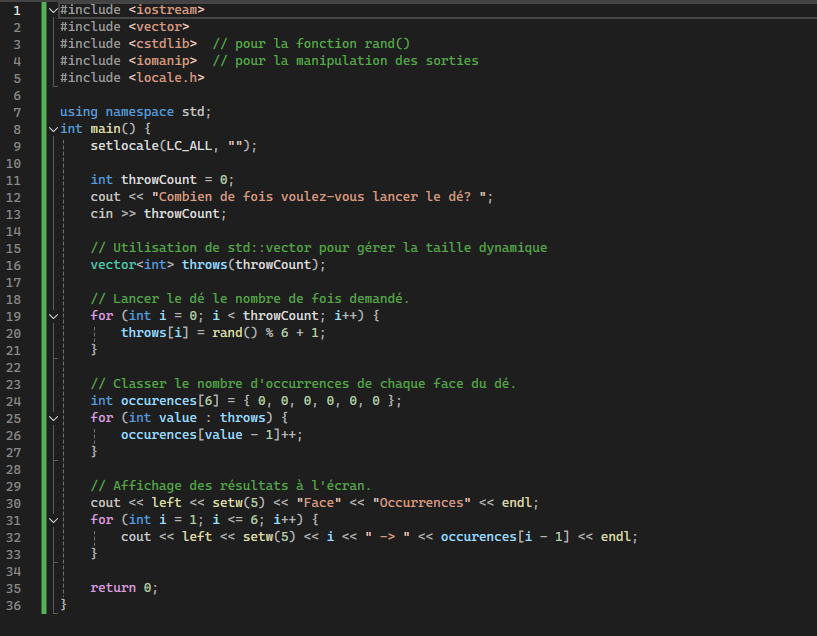

# Exercices (intro)

# Préambule
Pour chaque nouvelle section d'exercices, il est conseillé de se pratiquer à créer un projet nouveau et un fichier source dans lequel on expérimentera les questions qui vont suivre.


- Créer un nouveau projet nommé exercices_intro dans Visual Studio
- Créer un fichier source nommé exercices_intro.cpp
- En tête de fichier, écrire les 2 includes et le using suivants:

```cpp
#include <iostream>
#include <locale.h>
using namespace std;
```

Créer un main() dans ce fichier:
```cpp
int main(){
    setlocale(LC_ALL, "");// pour que les accents soient affichés
}

```
 En tout temps n'hésitez pas à expérimenter des commandes et à vous poser des questions!

 **Pour chaque question, mettre un commentaire qui donne le numéro de la question avant de l'écrire. Voir l'exemple ci-dessous**.

```cpp
int main(){
    //question 1

    //question 2

    //question 3

    ...
}
```

## Question 1

Dans le main de votre programme, faire **afficher** (cout) les éléments suivants un en dessous de l'autre. Rappel: si vous entrez une expression qui contient du texte, il faut mettre l'expression entre doubles guillemets (""). Il faut mettre un retour de ligne entre chaque sortie:

    - 34
    - "Je programme!"
    - 34 - 12
    - 4 * 9
    - 10 / 5
    - 11 / 5
    - "J'écris ceci exprès pour la ponctuation française!"
    - (4+9)*10/2
    - 4+9*10/2
    - 5 + 3 = 8

## Question 2

Est-ce que ce code fonctionne? Pourquoi? 

```cpp
#include <iostream>
#include <locale.h>

using namespace std;
int main() {
    2+6;
    return 0;
}
```

## Question 3 

Trouver l'erreur! 

Dans les codes fournis ci-dessous, trouver l'erreur de syntaxe qui s'est glissée dans le code. Vous aurez souvent besoin d'inspecter à l'oeil, les erreurs ne sont pas toujours clairement indiquées par le compilateur. N'HÉSITEZ PAS à écrire le tout dans Visual studio et à expérimenter!

```cpp
//code 1
using namespace std;
int main() {
    cout <<"bonjour";
    return 0;
}
```
```cpp
//code 2
#include <iostream>
using namespace std;
int main() {
    cout<< "bonjour"
    return 0;
}
```

```cpp
//code 3
#include <iostream>
using namespace std;
int main() {
    cout "bonjour";
    return 0;
}
```
```cpp
//code 4
#include <iostream>
using namespace std;
int main {
    cout<< "bonjour";
    return 0;
}
```
```cpp
//code 5
#include <iostream>
using namespace std;
int main() {
    cout<< "bonjour"<<end;
    return 0;
}
```

```cpp
//code 6
#include <iostream>
using namespace std;
int main() {
    cout<< 3 + 5 = 8;
    return 0;
}
```
```cpp
//code 7 
#include <iostream>
int main() {
    cout<< 3 + 5;
    return 0;
}
```
 
## Question 4
Pratique de clavier! Voici un code en image. Le but de l'exercice est de retranscrire ce code dans Visual Studio. Il n'est PAS demandé de le comprendre ni de l'expliquer. Assurez-vous de trouver vos touches de clavier!



