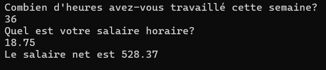

# Les variables

## Introduction

Si on écrit du code dans un éditeur de texte (éditeur de code), l'exécution se fera ligne par ligne jusqu'à la fin des instructions et puis le programme s'arrêtera... Mais si on a besoin de conserver les données pour un traitement, comment on va faire? On utilise les **variables**!

En termes simples, une variable est un espace mémoire qui est nommé et utilisé pour stocker des valeurs. Ces valeurs peuvent être de différents types : nombres, chaînes de caractères, booléens, etc. Les variables permettent aux programmes de gérer les données qui peuvent changer pendant l'exécution du programme.

### Pourquoi Utiliser des Variables ?
- Stockage des données : Les variables permettent de conserver des données que vous souhaitez réutiliser dans différentes parties de votre programme. Si, par exemple, je stocke le nombre d'heures où vous avez travaillé à votre emploi, on pourra aller récupérer ce nombre et calculer votre salaire.

- Réutilisabilité et clarté : les variables rendent votre code plus propre et plus facile à comprendre, car elles permettent de nommer des concepts de manière explicite.

### Ce qu'il faudra faire quand on code

- Déclarer les variables: Avant d'utiliser une variable, il faut la **déclarer**. Cela signifie que vous devez indiquer le **nom** de la variable et le **type de données** qu'elle va contenir. Voici une référence pour tous les types de variables en C++ et leur nom: https://cplusplus.com/doc/tutorial/variables/ 


- Initialiser la variable: Une fois déclarée, une variable peut être **initialisée** avec une **valeur**. L'initialisation est le processus de donner une valeur initiale à une variable au moment de sa création. Si on ne met pas de valeur, une **valeur par défaut** sera attribuée. Il faut être prudent avec cela! (Par exemple, le int par défaut est -858993460 et on ne peut pas l'afficher dans cout).

- Utiliser les variables:  Il sera possible d'effectuer diverses opérations sur les variables, telles que les additions, les soustractions, et les comparaisons. Les variables permettent aussi de manipuler des données plus complexes et de gérer des structures de données comme les tableaux et les objets.

Le site W3school https://www.w3schools.com/cpp/default.asp peut être utile pour chercher rapidement des informations de base en C++ (et plusieurs autres!). Il vulgarise bien les concepts simples.

### Exemples

Ici, on crée une variable de type "int" (entier) qu'on nomme "age". On initialise la variable avec la valeur 30 (=30). On utilise ensuite la variable en l'affichant (cout) entre les chaînes de caractères fixes "Âge : " ... " ans".

```cpp
#include <iostream>
#include <locale.h>
using namespace std;
int main() {
    setlocale(LC_ALL, "");// pour que les accents soient affichés

    int age = 30;
    cout << "Âge : " << age << " ans" << endl;

    return 0;
}
```
Si on veut mettre un chiffre à virgule (décimal), on devra choisir un autre type de contenant. Prenons la taille en mètres d'une personne. Attention!! Les nombres décimaux s'écrivent avec un point et non une virgule.

```cpp
#include <iostream>
#include <locale.h>
using namespace std;
int main() {
    setlocale(LC_ALL, "");// pour que les accents soient affichés

    float taille = 1.75;
    cout << "La taille est: " << taille << " mètres" << endl;

    return 0;
}
```


### Exercices en classe

Dans le main, 
- déclarer une variable de type "entier" nommée monNombre et placez le chiffre 7 à l'intérieur.
-  déclarer une variable de type "double" nommée monNombre2 et placez le chiffre 5.3 à l'intérieur.
- afficher le contenu des 2 variables un en dessous de l'autre.
- déclarer une variable de type double nommée somme et placez-y le résultat de l'addition des 2 variables précédentes. Attention, on veut le faire de manière **dynamique**, ce qui signifie qui s'adapte si la **variable** varie!
- afficher le résultat de votre calcul en-dessous des autres.

### Variables et exécution séquentielle

Si on déclare une variable, c'est parce qu'elle risque de varier (c'est logique!). Il est possible d'écraser le contenu d'une variable par un autre contenu. Le contenant reste le même (si on avait une variable de type int, on ne peut mettre que des entiers dedans).

Ci-dessous, on **déclare** la variable maVariable dans laquelle on place 4. Puis, on écrase la valeur par 7. Remarquez qu'on ne redéclare pas la variable, on l'utilise! 

```cpp
#include <iostream>
#include <locale.h>
using namespace std;
int main() {
    setlocale(LC_ALL, "");// pour que les accents soient affichés

    int maVariable = 4;
    cout <<"maVariable AVANT"<< maVariable <<endl;
    maVariable = 7;
    cout <<"maVariable APRÈS"<< maVariable <<endl;

    return 0;
}
```

Que vallent maVariable et monCalcul si on fait ceci? Affichez-les!
```cpp
#include <iostream>
#include <locale.h>
using namespace std;
int main() {
    setlocale(LC_ALL, "");// pour que les accents soient affichés

    int maVariable = 4;
    maVariable = 7;
    maVariable = 14;

    int monCalcul = 0;
    monCalcul = maVariable + 6;

    return 0;
}
```
On peut aussi réutiliser une variable dans une équation. Dans ce cas, ce qui se trouve à DROITE du symbole d'égalité est utilisé et ce qui est à GAUCHE du symbole sera écrasé. Exemple:

```cpp
#include <iostream>
#include <locale.h>
using namespace std;
int main() {
    setlocale(LC_ALL, "");// pour que les accents soient affichés

    int maVariable = 4;
    maVariable = maVariable + 7; // on fait 4 + 7 et on écrase l'ancien 4 par 11. Si on affiche maVariable on aura 11 maintenant. 

    return 0;
}
```


### Pourquoi déclarer des types particuliers?

On décide judicieusement du **contenant** où placer votre donnée pour éviter les erreurs. Si on essaie de placer un contenu dans un contenant, il faut que ça entre!

Exemples qui causent des erreurs ou des résultats incorrects:
- Mettre un type complètement différent dans un contenant (erreur)
```cpp
    int maVariable = 4;
    maVariable = "allo";
```

- Faire des opérations sur des types incompatibles
```cpp
    int maVariable = 4;
    maVariable = 6 + true; // donne 7
```
```cpp
    int maVariable = 4;
    maVariable = 6 + 4.5; // donne 10 au lieu de 10.5
```
```cpp
    int maVariable = 4;
    maVariable = maVariable / 3 ; // donne 1 au lieu de 0.75
```
```cpp
    string phrase = "Ceci est une chaîne de caractères";
    phrase = 119;
    cout << phrase << endl; // on obtient w ...
```

Pour les string et les char, si on fournit un nombre, on affichera un numéro de caractère dans la table [ASCII](https://www.ascii-code.com/fr).

### Comment bien choisir un type?

Types de base:

| Type         | Taille approximative (en octets) | Plage de valeurs                                 |
|--------------|----------------------------------|-------------------------------------------------|
| `bool`       | 1                                | `true` (1) ou `false` (0)                        |
| `char`       | 1                                | 1 seul caractère|
| `string` (std)       | 1                                | chaine de caractères|
| `short`      | 2                                | `-32 768` à `32 767`                             |
| `int`        | 4                                | `-2 147 483 648` à `2 147 483 647`               |
| `float`      | 4                                | Environ `3.4E-38` à `3.4E+38`                    |
| `double`     | 8                                | Environ `1.7E-308` à `1.7E+308`                  |

Quel type est le plus approprié?
- Pour entrer l'âge d'une personne
- Pour entrer le nombre d'heures de travail faits par une personne
- Pour prendre le total des achats dans une caisse enregistreuse
- Pour prendre le nom d'une personne
- Pour donner une cote à un cours (A,B,C,D,E).
- Déterminer si un chiffre est plus grand que 18 ou non


### Nomenclature

Règles à suivre pour les choix de noms de variables:
- seulement des chiffres, des lettres et le caractère _
- ne doit pas commencer par un chiffre
- ne doit pas contenir de blanc
- une majuscule et une minuscule sont différents (n et N sont différents)
- on utilise le Camel case pour les variables à plusieurs mots
- on choisit des noms significatifs pour se comprendre dans le futur (vous et cos collègues).
- on ne peut pas déclarer 2x une variable avec le même nom dans la même fonction.

### Exercices en classe

APRÈS l'exécution complète des instructions suivantes, que valent les variables a, b et c (quand elles sont présentes)? Ne pas oublier que le traitement est SÉQUENTIEL. Pour ne pas perdre le fil, on fera la TRACE de la valeur de chaque variable à chaque ligne, de haut en bas.

a)
```cpp
int a;
int b;
a = 1;
b = a + 3;
a = 3;
```
b)
```cpp
int a = 5;
int b = 3;
int c;
c = a + b;
a = 2;
c = b - a;
```
c)
```cpp
int a, b, c;
a = 3;
b = 10;
c = a * b;
b = a + b;
a = c;
```

d) Est-ce qu'on vient d'échanger les valeurs des 2 variables a et b?
```cpp
int a, b;
a = 5;
b = 2;
a = b;
b = a;
```
e) faire la trace du contenu de la variable à chaque ligne
```cpp
float x;
int a = 0;
x = 8.1;
x = x * 2;
a = x;
```
f) faire la trace du contenu de la variable à chaque ligne
```cpp
string maPhrase = "abc";
maPhrase = maPhrase + " efg"; // un + entre des chaîne de caractères va les concaténer
maPhrase = maPhrase + " hij";
maPhrase = " klm";
```


# Le cin (c-in)
En C++, `cin` est un objet de la bibliothèque standard qui signifie "console input" (entrée de la console). Il est utilisé pour lire des données depuis l'entrée de l'utilisateur (le clavier). L'objet cin fait partie de la bibliothèque <iostream>, qu'on inclut au début de nos programmes. 

### Comment l'utiliser
- il faut d'abord avoir un réceptacle (une variable) pour y déposer l'entrée de l'utilisateur. 
- il faut utiliser l'opérateur >> pour capturer les entrées et les stocker dans la variable.
- il est fortement recommandé de mettre un cout avant pour indiquer à l'utilisateur ce que vous souhaitez recevoir.
- l'utilisateur devra taper un nombre entier au clavier et faire "entrer".

Exemple:
```cpp
#include <iostream>
#include <locale.h>
using namespace std;
int main() {
    setlocale(LC_ALL, "");// pour que les accents soient affichés

    int age; // on crée un réceptacle pour recevoir l'âge entrée
    cout << "Quel est votre âge?" << endl;  // on pose une question (facultatif)
    cin >> age; //on capture la saisie clavier et on la place dans la variable age

    // On affiche pour montrer le résultat
    cout << "Vous avez " << age << " ans." << endl;
    return 0;
}
```


On peut en faire plusieurs à la fois:
```cpp
#include <iostream>
#include <locale.h>
using namespace std;
int main() {
    setlocale(LC_ALL, "");// pour que les accents soient affichés

    int annee, mois, jour; 
    cout << "Quel est votre date de naissance? (année/mois/jour)" << endl;  
    cin >> annee >> mois >> jour; 

    // On affiche pour montrer le résultat
    cout << "Vous êtes né le " << annee << "/" << mois << "/" << jour << endl;
    return 0;
}
```

## Constantes

Il est possible de déclarer des valeurs constantes pour les utiliser dans le code avec un nom de variable. Elles sont placées AVANT le main et après les include et using.

```cpp
#include <iostream>
#include <locale.h>
using namespace std;

const int ma_constante = 10;
ma_constante = 12; //n'est pas permis

int main(){
    ...
}

```
Pourquoi faire une variable non modifiable? 


## Dans quel ordre faire les choses?

Si on souhaite coder un problème, il faut s'assurer que l'ordre dans lequel on fait les choses va fonctionner. On peut aussi revoir les 7 étapes du cours d'introduction.

Exemple d'énoncé pour lequel on veut écrire le code:<br>
    Faire l'algorithme qui permettra de calculer le salaire net (après déductions) d'un employé lorsque les seuls prélèvements à la source (déductions) sont un taux d'imposition de 20 % et un montant de 11.63 pour l'assurance chômage, en sachant que son salaire brut (sans déductions) est calculé en fonction du nombre d’heures travaillées et son salaire horaire.

- Vous ne connaissez rien dans ce domaine? Ce n'est pas grave, en tant qu'informaticien, on doit se plonger dans toute sorte de domaines! On n'a qu'à décortiquer en étapes.

- Étape 1
    Se faire un exemple pour comprendre. On imagine un employé qui fait 36 heures de travail et qui travaille à 18.75$ de l'heure. Cet employé aura
    - 36 x 18.75 = 675 dollars de salaire brut
    - 675 x 0.20 = 135 dollars d'impôts à enlever
    - 675 - 135 - 11.63 = 528.37 dollars de salaire net

- Étape 2
    Repérer et nommer les informations.
    - On a le nombre 20% qui ne change pas (constante tauxImpot)
    - On a le nombre 11.63 qui ne change pas (constante mntChomage)
    - On a besoin du nombre d'heures de l'usager (variable nbHeures)
    - On a besoin du salaire horaire de l'usager (variable tauxHoraire)

- Étape 3
    Identifier les traitements. Ici, on sait qu'il faut (PAS dans le bon ordre);
    - demander les informations à l'usager 
    - calculer le salaire net 
    - calculer le salaire brut 
    - calculer les impôts à payer
    - afficher le résultat

- Étape 4
    Ordonner si ça n'est pas fait à l'étape précédente. On ne peut pas calculer le salaire brut avant de savoir combien il faut déduire. Il faut donc que le salaire à déduire soit calculer avant.
    - demander les informations à l'usager 
    - calculer le salaire brut 
    - calculer les impôts à payer
    - calculer le salaire net
    - afficher le résultat

- Étape 5
    Préciser les instructions. On décortique chaque traitement
    - demande les informations à l'usager:
        - déclaration des variables nbHeures et tauxHoraire avec leur type respectif.
        - demander l'info avec un cout pour une variable à la fois.
        - récupérer les réponses avec un cin pour les mettre dans les variables. Récupérer une réponse avant de poser la 2e question.
    
    - calculer le salaire brut
        - déclaration de la variable salaireBrut du type approprié.
        - multiplier les 2 variables nbHeures et tauxHoraire pour les affecter à salaireBrut.
    
    - calculer impôts à payer
        - déclaration de la variable impotsAPayer du type approprié.
        - calcul de 20% du salaireBrut qu'on affecte à impotsAPayer.
    
    - calculer le salaire net
        - déclaration de la variable salaireNet du type approprié
        - calcul des déductions du salaireBrut - mntChomage - impotsAPayer et affectation à la variable salaireNet.
    
    - afficher le résultat
        - faire un cout avec une phrase et le contenu de la variable salaireNet.

Le code se lira comme suit:
```cpp
#include <iostream>
#include <locale.h>
using namespace std;

const float mntChomage = 11.63;
const float tauxImpot = 0.20;

int main() {
	setlocale(LC_ALL, "");

	int nbHeures;
	float tauxHoraire;

	cout << "Combien d'heures avez-vous travaillé cette semaine? " << endl;
	cin >> nbHeures;
	cout << "Quel est votre salaire horaire?" << endl;
	cin >> tauxHoraire;

	float salaireBrut = tauxHoraire * nbHeures;
	float impotsAPayer = salaireBrut * tauxImpot;
	float salaireNet = salaireBrut - impotsAPayer - mntChomage;

	cout << "Le salaire net est " << salaireNet << endl;

}
```

- Étape 6
    On teste! Pour le moment, on ne testera pas toutes les possibilités, on reste dans la simplicité. On peut, par exemple, essayer notre exemple de départ. <br>
    


