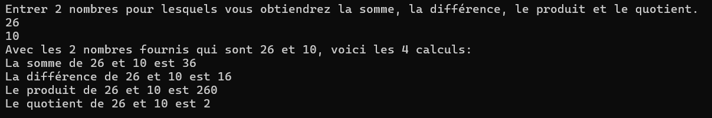

# Exercices (variables)

# Préambule
Il est conseillé d'avoir une fonction par question pour faire les exercices. 

Conseil organisation: un fichier .cpp par série d'exercices, nommés par un nom court et significatif, par exemple:
- sem1_variable.cpp
- sem2_if_else.cpp
...

Chaque fichier doit contenir une fonction main. Chaque projet peut avoir plusieurs fichiers, mais ne doit contenir qu'un seul main dans tous les fichiers confondus..

```cpp
#include <iostream>

using namespace std;


void question1(){
    
    //Mettre le contenu de la question 1 ici. 
               
}


void question2(){
    
    //Mettre le contenu de la question 2 ici.
     
}


// Le main est toujours en bas des fonctions appelées
int main()
{
    question1();  //activer la question 1
    
    // la question 2 est en commentaire, elle ne s'exécutera pas
    //question2();  

    return 0;
}
```


## Question 1

Dans le main de votre fichier source:
1. Déclarer une variable nommée heures de type float. Y mettre le nombre d'heures travaillées la semaine passée (inventez-en un si vous ne travaillez pas).
2. Déclarer une variable de type float nommée tauxHoraire. Placez-y le taux horaire ($/heure) qui vous ferait plaisir.
3. Déclarer une variable salaire dans laquelle on place le nombre d'heures multiplié par le tauxHoraire. De quel type déclarez-vous la variable salaire?
4. Afficher une phrase complète qui dit quelque chose semblable à ceci: "Si on fait ... heures de travail à un taux de ... $/heure, on fera un salaire brut de ..."

## Question 2

Dans le main de votre fichier source:
- Déclarer 2 variables entières: x = 5 et y = 8
- Trouver une façon pour interchanger (permuter) le contenu des 2 variables de façon dynamique (c'est-à-dire qui s'adaptera et fonctionnera peu importe les valeurs initiales de x et y).
- Afficher les résultats AVANT et APRÈS la permutation. Par exemple, en console, on devrait voir:<br>

 <br>


## Question 3
Opération sur les variables avec différents types

a) Observer et décrire ce qui se produit pour chaque affectation de valeur à une variable.
```cpp
int b = 5;
float k = 3.7;
char c = 'A';

b = b + 100;      
k = k * 2;       
c = b;           

```

- Que contient b à la fin?
- Que contient k à la fin?
- Que se passe-t-il quand on affecte b à c?

b) Observer et décrire ce qui se produit pour chaque affectation de valeur à une variable.
```cpp
int n = 3;
double z = 4.5;
char lettre = 'B';

z = n / 2;          
n = z * 10;         
lettre = lettre + n;  
```
- Que vaudra z? Pourquoi la valeur n'est pas celle attendue?
- Que se passe-t-il avec lettre?


c) Observer et décrire ce qui se produit pour chaque affectation de valeur à une variable.
```cpp
float f = 3.14;
int i = 1;
double d = 2.718;

f = f * i;           
d = f + d;           
i = d;               
```
- Que vaudront f et d à la fin?
- Que se passe-t-il avec i quand on met d dans i?

d) Que se passe-t-il ici?
```cpp
int nb1 = 10;
int nb2 = 0;
float resultat;

resultat = nb1 / nb2;  // Que se passe-t-il ici ?
```

## Question 4

Calculons la somme des n premiers nombres entiers positifs. La formule mathématique pour y arriver est somme = n(n+1)/2. Il faudra demander à la personne qui utilise le programme d'entrer un nombre. Si, par exemple, elle entre le nombre 100, on lui affichera la somme de 1+2+3+4+5+...+100 en faisant 100*101/2 = 5050. Pour y parvenir, suivre les étapes suivantes:
1. Déclarer une variable qui va pouvoir recevoir le nombre entier qu'on demandera à l'utilisateur
2. Déclarer une variable qui prendra le calcul qu'on fera avec le chiffre obtenu.
3. Demander à l'utilisateur d'entrer un nombre
4. Attraper sa réponse et la mettre dans la variable prévue à l'étape 1.
5. Faire le calcul avec la réponse obtenue et mettre le résultat dans la variable prévue à l'étape 2.
6. Afficher une phrase qui explique que la somme des nombres 1 à n donne ...

## Question 5

On donne le diamètre de trois planètes : la Terre = 12 757 km, Mars = 6 800 km et Jupiter = 139 800 km. Calculer et afficher le nom de la planète, son diamètre, son rayon et son volume. Les nombres doivent être mis dans des variables et les calculs aussi. À titre de rappel mathématique,

$$ 
rayon = diamètre/2
$$

$$
volume = \frac{4 * 3.1416 * rayon^3}{3} 
$$  

Pensez à bien décortiquer les étapes avant d'écrire le code. Est-ce que certaines valeurs devraient être constantes?

## Question 6

Calculer le montant qu'on doit charger au client lors de l'achat d'un bien quand on rajoute les taxes. Le montant des taxes s'élève à 14,975% du montant qu'on ajoute à ce montant. Vous devez demander le montant à l'utilisateur avant d'utiliser son entrée pour calculer le total et lui afficher le total.

## Question 7

Faire une petite calculatrice dans laquelle on demande 2 nombres entiers à l'utilisateur (par exemple 26 et 10). Ensuite, afficher les informations suivantes:



## Question 8 

Demander à un utilisateur d'entrer un nombre de secondes (idéalement assez grand). Puis, convertissez ce nombre en années, mois, jours, heures, minutes, secondes. Il est possible d'y arriver seulement avec des calculs mathématiques comme le modulo et la division entière.
Par exemple, si un usager entre 53 000 000 secondes, on lui affiche que ça donne 1 an, 248 jours, 10 heures, 13 minutes et 20 secondes. On suppose qu'il y a toujours 365 jours dans une année.

