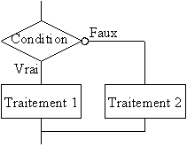
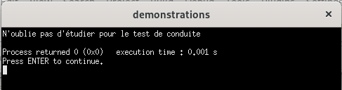
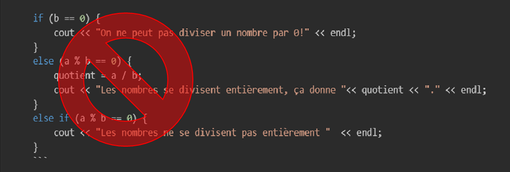

# Structures alternatives

En programmation, une structure alternative est un bloc de code qui permet de choisir entre plusieurs chemins d'exécution en fonction de conditions spécifiques. En C++, les structures alternatives permettent de contrôler le flux d'un programme en prenant des décisions basées sur des conditions logiques.

Jusqu'à présent, les instructions à effectuées étaient toutes exécutées, sans exception. Cependant il est très rare qu’un problème se résolve par un seul traitement linéaire. À certains moments le problème demandera de faire un choix i.e. qu'il y aura certaines opérations qui seront exécutées selon une **condition**.

On peut donc faire différents traitements selon une condition. Le chemin à suivre dépend de la condition imposée.<br>



## Conditions

Une condition est une déclaration qui peut être **soit vraie soit fausse**. C'est comme une question à laquelle on peut répondre par oui ou non. 
Par exemple, une condition peut être "est-ce que la personne a 18 ans ou plus?"
- Si oui, on affiche qu'elle est majeure
- Si non, on affiche qu'elle est mineure

### Opérateurs relationnels

Les opérateurs relationnels permettent d’effectuer une comparaison entre deux valeurs ou expressions. Ces opérateurs sont :

| Symbole | Explication                 |Autres mots clés      |
|---------|-----------------------------|--------------|
| `<`     | plus petit                  |`inférieur à`, `strictement plus petit que`|
| `>`     | plus grand                  |  `supérieur à`, `strictement plus grand que`|
| `<=`     |plus petit ou égal          |`... et moins`, `au maximum`|
| `>=`     | plus grand ou égal         |`... et plus`, `au minimum`|
| `!=`     | différent                  |
| `==`     | équivalent                 |

NE PAS CONFONDRE `=` avec `==`. L'égalité simple sert à AFFECTER une valeur à une variable, pas à COMPARER 2 valeurs.

### Exercice en classe 
> Question 1<br>
Parmi les affirmations suivantes, lesquelles pourraient être une **condition** valide pour une prise de décision? On prend pour acquis que les variables sont déclarées et contiennent une valeur chaque
- x > 4
- x + 5 == 10
- x - 9 = 15
- maVariable == "bleu"
- c + b < a
- 5 + 6 == 8
- nomParc != "St-Roch"
- a > b
- "a" > "b"
- `true`
- reponse == `false`
- 5 < y / 12

> Important: 
> - Si on compare 2 variables, pour avoir un résultat cohérent, elles doivent être de même type.

> Question 2<br>
Dire si les conditions suivantes sont vraies ou fausses. 

a)
```cpp
int x = 14;
(x - 6 == 10);
(x - 6 < 10);
(10 != x + 6);
```

b)
```cpp
float m = 12.4;
float k = 12.3;
(m > k);
(m + k <= 20);
(37 >= 2*k + m)

```

c) 2 types différents (bizarre, ça arrive par erreur habituellement!)
```cpp
int a = 1;
char b = 'W';
(a == b);
(a < b);
(a != b);
(a == true);
```

## Instruction `if`

Lorsqu'on a bien déterminé une condition, on peut s'en servir pour décider si on fait un traitement (comme dans le schéma plus haut). Par exemple, si on veut faire un traitement qui s'applique seulement aux gens de 16 ans et plus, on fera ceci
```cpp
if (age >= 16){
    cout <<"Vous avez le droit de prendre un cours de conduite!";
}
```

> Important:
> - On met toujours la condition entre parenthèses
> - On ne met JAMAIS de ; après la condition

Pourquoi les accolades? Si on veut faire écrire ces 2 phrases pour les personnes de 16 ans et plus, il faut mettre les accolades ouverte après la condition du if et fermée après la 2e phrase. Sinon, dans l'exemple ci-dessous, il n'y a que la première phrase qui sera touchée par le if. La 2e phrase s'affichera toujours. L'indentation ne change rien pour la compilation, elle aide à garder une clarté pour les programmeurs.
```cpp
int age = 14;
if (age >= 16) 
    cout << "Inscris-toi pour obtenir un cours de conduite"<<endl;
    cout << "N'oublie pas d'étudier pour le test de conduite"<<endl;
```
<br>

contrairement à:
```cpp
int age = 14;
if (age >= 16) {
    cout << "Inscris-toi pour obtenir un cours de conduite"<<endl;
    cout << "N'oublie pas d'étudier pour le test de conduite"<<endl;
}
```
Rien n'apparaît pour la personne de 14 ans.

## Conditions plus élaborées

### Négation
Pour indiquer qu'on veut le contraire de la condition exprimée, on met le symbole `!` devant la condition. Si on veut, par exemple, les nombres qui ne sont pas plus grands que 10, on peut écrire:
> nombre <= 10 <br>
> ou<br>
> !(nombre > 10)

Exemple: Dans un jeu vidéo, si on n'a pas obtenu au moins 12 pièces (argent), le jeu nous donne une aide de 5 pièces. On peut traduire ce traitement conditionnel de 2 façons:
```cpp
if (pieces < 12) { // contraire de "au moins 12", c'est "moins de 12"
    pieces = pieces + 5;
}
```
OU BIEN

```cpp
if (!(pieces >= 12)) { // n'a pas (!) au moins 12  (>=12)
    pieces = pieces + 5;
}
```

### Opérateur logique OU (`||`)

L'opérateur OU est utilisé en programmation pour vérifier si **au moins une** de plusieurs conditions est vraie. C'est un peu comme se demander : "Est-ce que l'une de ces options est vraie ?". Si la réponse est "oui" pour au moins une des options, alors l'ensemble de la condition est considéré comme vraie.

> Les expressions impliquées dans un OU doivent toujours être soit vraies, soit fausses. 

Exemple: (*notez qu'il s'agit d'un exemple fictif et non d'un fait météo vérifié*)

On a une variable booléenne appelée `notificationMeteo` qui doit être "allumée" (donc avoir la valeur vraie) si on observe un des phénomènes suivants:
- le vent souffle à plus de 100 km/h
- la température extérieure est au-dessus de 45 degrés
- la température extérieure est de -39 degré ou moins
- il y a un ouragan en route vers la région

```cpp
bool notificationMeteo = false; // on initialise à false pour qu'il n'y a pas de notification par défaut
float vitesseVent = 0; // on initialise à 0 vent
float temperatureExterieure; // on n'a pas de température par défaut
bool ouraganEnRoute = false; // on initialise en n'ayant pas d'ouragan (cela sera changé si nécessaire)

/**
On veut que, si UN SEUL des 4 phénomènes se produit, on allume la notificationMeteo
le vent souffle à plus de 100 km/h    =>   vitesseVent > 100
la température extérieure est au-dessus de 45 degrés   =>   temperatureExterieure > 45
la température extérieure est de -39 degré ou moins    =>   temperatureExterieure <=-39
il y a un ouragan en route vers la région     =>  ouraganEnRoute == true
**/

//affecter 4 valeurs aux 4 variables et faire des tests!

if (vitesseVent > 100 || temperatureExterieure > 45 || temperatureExterieure <=-39 || ouraganEnRoute == true){
    notificationMeteo = true;
}
```

Comment pourrait-on tester la condition pour être certain que ça fonctionne? 
Testons-là!


### Opérateur logique ET (&&)
L'opérateur ET (&&) est utilisé en programmation pour vérifier si **toutes** les conditions spécifiées sont vraies. Si **une seule** des conditions est fausse, l'ensemble de la condition est considéré comme fausse.

> Les expressions impliquées dans un ET doivent toujours être soit vraies, soit fausses. 

Exemple:  (*notez qu'il s'agit d'un exemple fictif et non d'un fait météo vérifié*)

On a une variable booléenne appelée `tornadePotentielle` qui doit être "allumée" (donc avoir la valeur vraie) si on observe tous les phénomènes suivants en même temps:
- il y a un orage supercellulaire
- il y a une instabilité atmosphérique
- le point de rosée est au dessus de 20 degrés.

```cpp
bool orageSupercellulaire;
bool instabiliteAtmospherique;
int pointDeRosee;

//affecter 4 valeurs aux 3 variables et faire des tests!

if (orageSupercellulaire == true && instabiliteAtmospherique == true && pointDeRosee > 20) {
    tornadePotentielle = true;
}

```

### Exercice en classe 
> Question 3<br>
Voici une expression qui contient un `if`. Allez ensuite aux questions en dessous et dites ce qui affichera en console selon les valeurs de variables fournies. Ne pas négliger l'ordre d'apparition des couleurs.

```cpp
if ((a < 3) && (b != "allo") && (8 - a > c)){
    cout << "bleu"<<endl;
}
cout << "vert"<< endl;

if ((a < 3) || (b != "allo") || (8 - a > c)){
    cout << "jaune"<<endl;
}
cout << "rouge"<< endl;
```
a) 
```cpp
int a = 13;
string b = "allo";
int c = -10;
```
b) 
```cpp
int a = 3;
string b = "alo";
int c = 6;
```

c) 
```cpp
int a = 1;
string b = "Allo";
int c = -10;
```
d) 
```cpp
int a = 2;
string b = "allo";
int c = 6;
```
e) 
```cpp
int a = 2;
string b = "allo";
int c = 5;
```

f) 
```cpp
int a = -2;
string b = "bonjour";
int c = 7;
```

## Instruction `else` et `else if`
L'instruction else est utilisée pour exécuter un bloc de code alternatif si la condition dans un if est fausse. Autrement dit, elle permet de définir ce qui doit se passer si la condition initiale n'est pas remplie.
- `if` : Vérifie une condition. Si elle est vraie, le code à l'intérieur du `if` s'exécute.
- `else` : Fournit une alternative pour ce qui doit se passer si la condition dans le `if` est fausse

Exemple simple:

```cpp
int age = 16;

if (age >= 18) {
    cout << "Vous êtes majeur." << endl;
} else {
    cout << "Vous êtes mineur." << endl;
}

```
> Un `else` vient TOUJOURS accompagné d'un `if`. Un `if` peut être seul, sans `else`.

> IMPORTANT: dans une structure `if` `else`, on n'accède qu'à UN SEUL traitement. Si on a une condition vraie dans le `if`, on fait le traitement du `if` et on ne fait PAS celui du `else`. Si on n'entre pas dans le `if`, on va automatiquement dans le `else`.


- `else if`: Peut servir pour augmenter le nombre de choix.

Exemple:

1. On veut donner un message différent selon la note obtenue à une évaluation.
```cpp
int note = 70;

if (note >= 90) {
    cout << "Excellent !" << endl;
} else if (note >= 75) {
    cout << "Très bien." << endl;
} else if (note >= 50) {
    cout << "Passable." << endl;
} else {
    cout << "Échec." << endl;
}
```

2. On souhaite effectuer une division de 2 nombres entiers et afficher la réponse seulement si le quotient donne un entier. Si on réfléchit aux diverses possibilités, on a:
- les 2 nombres donne un résultat entier (on utilise le modulo)
- les 2 nombres ne donnent pas un résultat entier (on utilise le modulo)
- si le diviseur est 0, on fait planter le système! Il faut éviter de faire une division si le 2e nombre est 0.

Il ne faut pas que la division soit calculée du tout si le 2e chiffre est 0... on commence donc par cette condition dans le `if`

```cpp
    int a;
    int b;
    int quotient;
    cout << "entrer un nombre entier:" << endl;
    cin >> a;
    cout << "entrer un nombre entier qui sera le diviseur du premier:" << endl;
    cin >> b;

    if (b == 0) {
        cout << "On ne peut pas diviser un nombre par 0!" << endl;
    }
    else if (a % b == 0) { //else if doit avoir une condition
        quotient = a / b;
        cout << "Les nombres se divisent entièrement, ça donne "<< quotient << "." << endl;
    }
    else { // pas de condition
        cout << "Les nombres ne se divisent pas entièrement "  << endl;
    }

```

> Portez attention à la syntaxe (les accolades qui ouvrent et ferment le `if`, qui ouvrent et ferment le `else if` et aussi le `else`.)
> Le `else`, quand on en met un, doit être en dernier.



## Imbrication de structures conditionnelles

Dans les accolades d'un bloc `if`, `else if` ou `else`, il est possible de faire des instructions séquentielles ou bien de remettre une autre structure alternative. 

Exemple: Imaginons un scénario où vous vérifiez d'abord si un utilisateur a un accès administrateur, puis si son compte est actif. Vous n'êtes autorisé à effectuer certaines actions que si les deux conditions sont remplies. On peut faire ceci:

```cpp
bool estAdmin = true;
bool compteActif = false;

if (estAdmin) {
    if (compteActif) {
        cout << "Vous pouvez accéder à la zone administrateur." << endl;
    }else {
        cout << "Votre compte est inactif." << endl;
    }
}else {
    cout << "Vous n'avez pas les privilèges administrateur." << endl;
}

```

### Comment ça fonctionne?
1. Premier if (vérifie estAdmin) :
    - Le programme commence par vérifier si `estAdmin` est vrai.
    - Si estAdmin est faux, le programme ignore le bloc de code interne et passe directement au else associé au premier `if`.
2. Deuxième `if` (imbriqué) :
    - Si `estAdmin` est vrai, le programme entre dans le bloc du premier `if` et commence à vérifier la deuxième condition avec le `if` imbriqué (ici, `compteActif`).
    - Si `compteActif` est vrai, le message "Vous pouvez accéder à la zone administrateur." est affiché.
    - Si `compteActif` est faux, le programme exécute le `else` du deuxième `if` et affiche "Votre compte est inactif."


## Instruction switch
L'instruction switch est utilisée pour sélectionner l'une parmi plusieurs options possibles **basées sur la valeur** d'une expression. Contrairement à une série de if-else if, où chaque condition est évaluée une par une, l'instruction switch évalue une seule fois l'expression donnée, puis dirige le flux d'exécution vers le bloc de code correspondant.

Syntaxe de base:
 ```cpp
 switch (expression) {
    case valeur1:
        // Code à exécuter si expression == valeur1
        break;
    case valeur2:
        // Code à exécuter si expression == valeur2
        break;
    case valeur3:
        // Code à exécuter si expression == valeur3
        break;
    default:
        // Code à exécuter si aucune des valeurs ne correspond
        break;
}
```
- La variable `expression` est généralement de type int ou char en C++.
- Chaque `case` représente une valeur possible que peut prendre `expression`
- L'instruction `break` empêche l'exécution des autres cas qui suivent. Il faut toujours le mettre à la fin d'un case.
- L'instruction `default` est optionnelle. Il est toutefois fortement recommandé de le mettre, au cas où la valeur d'`expression` ne correspond à aucune valeur. C'est comme un "else" pour le switch.

Exemple:

```cpp
    int choix;

    cout << "Choisissez un niveau de difficulté (1, 2, 3) : ";
    cin >> choix;

    switch (choix) {
    case 1:
        cout << "Vous avez choisi le niveau Facile." << endl;
        break;
    case 2:
        cout << "Vous avez choisi le niveau Moyen." << endl;
        break;
    case 3:
        cout << "Vous avez choisi le niveau Difficile." << endl;
        break;
    default:
        cout << "Choix invalide !" << endl;
        break;
    }

    return 0;
```
Le switch sera utilisé pour la gestion des options d'un menu.

## Combinaison de || et &&

Il est important de savoir que le && a priorité sur le | |. Donc si on fait ceci:

```cpp
if (nombre > 8 && nombre < 17 || nombre % 2 == 0){
    ...
}
``` 

le résultat de la relation entre les 2 conditions reliées avec un && sera prioritaire à la jonction des expressions avec un | |. Vous verrez les priorités des opérations et des opérateurs dans le cours de notions d'algorithme.