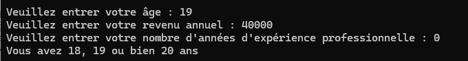
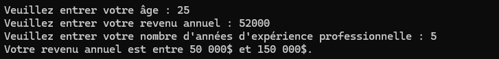
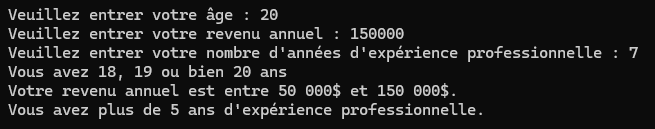
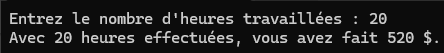
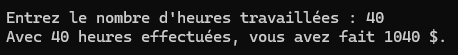
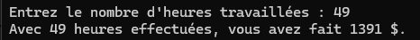
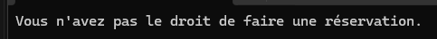
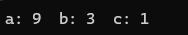
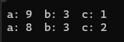

# Solutions (if else)

## Question 1




## Question 2




Code 

```cpp
    float nbHeures;
    float salaire;

    cout << "Entrez le nombre d'heures travaillées : ";
    cin >> nbHeures;

    if (nbHeures > 40) {
        salaire = (nbHeures - 40) * 39 + 40 * 26;

    }
    else {
        salaire = nbHeures * 26;
    }
```

## Question 3
a) <br>
<br>
b) <br>
<br>
c)<br>
<br>
d) <br>
```cpp
    bool utilisateurConnecte = true;
    bool droitReservation = true;
    bool placesDisponibles = false;
```

## Question 4

a) <br>
<br>
b) <br>
<br>

## Question 5
### 1)
```cpp
      float x;
      float y;
      cout << "entrez 2 nombres" << endl;
      cin >> x >> y;

      if (x >= y) {
          cout << "Le plus grand est " << x << endl;
      }
      else {
          cout << "Le plus grand est " << y << endl;
      }

```

### 2)
```cpp
      int A, B, C;
      cout << "entrer la borne inférieure: " << endl;
      cin >> A;
      cout << "entrer la borne supérieure: " << endl;
      cin >> B;
      cout << "entrer un nombre pour la vérification des bornes: " << endl;
      cin >> C;

      if (A > B) {
          cout <<"La borne inférieure est plus grande que la borne supérieure..." << endl;

      }
      else  if (C >= A && C <= B) {
          cout << C << " est compris entre " << A << " et " << B << endl;

      }
      else {
          cout << C << " n'est pas compris entre " << A << " et " << B << endl;
      }
```

### 3)
```cpp
      int u;
      cout << "Entrez un nombre entier " << endl;
      cin >> u;
      if (u % 2 == 0) {
          cout << "le nombre " << u << " est pair" << endl;
      }
      else {
          cout << "le nombre " << u << " est impair" << endl;
      }
```

### 4)
```cpp
      int annee;
      cout << "Entrez une année " << endl;
      cin >> annee;
      if (annee % 4 == 0) {
          cout << "l'année " << annee << " est bissextile" << endl;
      }
      else {
          cout << "l'année " << annee << " n'est pas bissextile" << endl;
      }
```

### 5)
```cpp
      int w;
      cout << "Entrez un nombre entier " << endl;
      cin >> w;
      if (w >= 73 && w <= 111 && w % 2 != 0) {
          cout << "Pas d'erreur" << endl;
      }
      else {
          cout << "Erreur" << endl;
      }
```

### 6)
```cpp
    float k, l, m;
    cout << "Entrer 3 nombres quelconques." << endl;
    cin >> k >> l >> m;

    if (k >= l && k >= m) {
        cout << "Le plus grand nombre est " << k << endl;
    }
    else if (l >= m) {
        cout << "Le plus grand nombre est " << l << endl;
    }
    else {
        cout << "Le plus grand nombre est " << m << endl;
    }
```

### 7)
```cpp
    if (k >= l && k >= m) {
        if (l >= m) {
            cout << "L'ordre est " << m << ", " << l << ", " << k << endl;
        }
        else {
            cout << "L'ordre est " << l << ", " << m << ", " << k << endl;
        }
    }
    else if (l >= m && l >= k) {
        if (m >= k) {
            cout << "L'ordre est " << k << ", " << m << ", " << l << endl;
        }
        else {
            cout << "L'ordre est " << m << ", " << k << ", " << l << endl;
        }
    }
    else {
        if (l >= k) {
            cout << "L'ordre est " << k << ", " << l << ", " << m << endl;
        }
        else {
            cout << "L'ordre est " << l << ", " << k << ", " << m << endl;
        }
    }
```
### 8-1)
```cpp
    float g, h;
    char operation;

    cout << "entrez 2 nombres avec le symbole de l'opération à effectuer entre les 2" << endl;
    cin >> g >> operation >> h;

    if (operation == '+') {
        cout << g << operation << h << " = " << g + h << endl;
    }
    else if (operation == '-') {
        cout << g << operation << h << " = " << g - h << endl;
    }
    else if (operation == '*') {
        cout << g << operation << h << " = " << g * h << endl;
    }
    else if (operation == '/') {
        cout << g << operation << h << " = " << g / h << endl;
    }
    else {
        cout << "L'opération n'est pas valide." << endl;
    }
```

### 8-2
```cpp
    switch (operation) {
    case '+':
        cout << g << operation << h << " = " << g + h << endl;
        break;
    case '-':
        cout << g << operation << h << " = " << g - h << endl;
        break;
    case '*':
        cout << g << operation << h << " = " << g * h << endl;
        break;
    case '/':
        cout << g << operation << h << " = " << g / h << endl;
        break;
    default:
        cout << "L'opération n'est pas valide." << endl;
    }
```

### 9
```cpp
    const float prix1 = 35; //un int fait aussi l'affaire, mais logiquement, un prix peut être décimal
    const float prix2 = 30;
    const float prix3 = 25;
    const float prix4 = 20;
    int nombreLivres = 0;
    float totalAchat = 0;

    cout << "entrez le nombre de livres achetés: " << endl;
    cin >> nombreLivres;

    if (nombreLivres < 5) {
        totalAchat = prix1 * nombreLivres;
    }
    else if (nombreLivres <= 29) {
        totalAchat = prix2 * nombreLivres;
    }
    else if (nombreLivres <= 49) {
        totalAchat = prix3 * nombreLivres;
    }
    else {
        totalAchat = prix4 * nombreLivres;
    }
    cout << "Le total des achats s'élève à " << totalAchat << "$ "<< endl;
```
