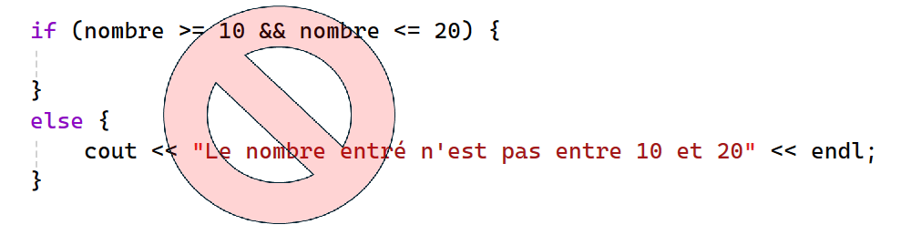

# Solutions (Validation de condition)

## Question 1

Si on met un opérateur || à la place du &&, on ne fait pas de filtre, parce que les nombres sont tous soit en bas de 10 ou en haut de 20 (une des 2 conditions étant vraie, on obtient vrai pour l'évaluation de la condition OU)

```cpp
float nombre;

cout << "entrer un nombre entre 10 et 20:" << endl;
cin >> nombre;

if (nombre >= 10 && nombre <= 20) {
	cout << "Le nombre entré est bon!" << endl;
}
else {
	cout << "Le nombre entré n'est pas entre 10 et 20" << endl;
}
```

## Question 2

Important: on ne met pas de if vide. C'est une mauvaise pratique.



Réponse: Puisqu'on ne ne fait RIEN quand on a un bon nombre, on n'a pas besoin de le traiter dans la structure conditionnelle.

```cpp
	if (nombre < 10 || nombre > 20) {
		cout << "Le nombre entré n'est pas entre 10 et 20" << endl;
	}

```


## Question 3

1. Ce programme lit le nom d'un étudiant, sa notes à l'examen 1 (qui vaut 35% de la session), sa note à l'examen 2 (qui vaut 40% de la session) et sa note au TP (qui vaut 25%). Il calcule la moyenne pondérée et indique à l'utilisateur si l'étudiant a un échec (moyenne en bas de 60%), une réussite partielle (une moyenne de 60 ou plus avec au moins une note en bas de 60) ou bien une réussite totale.

2. et 3. Plusieurs modifications: le texte à afficher est identique partout sauf pour les derniers mots. Il est donc préférable de mettre le bout de texte changeant dans une variable et d'écrire un seul cout qui s'ajuste dynamiquement selon la valeur obtenue.

    Les conditions ont aussi trop d'information. Si on valide la condition du premier if, on traite alors toutes les notes inférieures à 60. Si on se rend au premier ou au 2e else if, on est ASSURÉS que la moyenne est supérieure ou égale à 60. C'est pourquoi la re-vérification est enlevée. Voici le résultat:

```cpp
int noteExamen1, noteExamen2, noteTP;
string nomEtudiant;
float moyennePonderee;
string message = ""; //mettre le seul bout de texte qui change dans une variable

cout << "Veuillez entrer le nom de l'étudiant" << endl;
cin >> nomEtudiant;

cout << "Veuillez entrez la note de l'examen 1" << endl;
cin >> noteExamen1;

cout << "Veuillez entrez la note de l'examen 2" << endl;
cin >> noteExamen2;

cout << "Veuillez entrez la note du TP" << endl;
cin >> noteTP;

moyennePonderee = noteExamen1 * 0.35 + noteExamen2 * 0.4 + noteTP * 0.25;

if (moyennePonderee > 0 && moyennePonderee < 60 ) {
	message = "un échec";
}
else if (noteExamen1 < 60 || noteExamen2 < 60 || noteTP < 60) {
	message = "une réussite partielle";
}
else {
	message = "une réussite totale";
}
cout << "L'étudiant " << nomEtudiant << " a eu la note de " << moyennePonderee << ". Il a donc " << message << endl;
```

## Question 4

Voici le code:

```cpp
	string motDePasse = "";
	regex lePattern("^[A-Za-z0-9]{7,9}$");

	cout << "entrez votre mot de passe: " << endl;
	cin >> motDePasse;
	if (regex_match(motDePasse, lePattern)) {
		cout << "Le mot de passe respecte les règles." << endl;
	}
	else {
		cout << "Le mot de passe ne correspond pas aux règles." << endl;
	}
```

Pour bien tester le code, valider avec les valeurs suivantes:

- des chiffres seulement (en mettre 7, 8, 9 moins de 7 et plus de 9)
- des minuscules seulement (en mettre 7, 8, 9 moins de 7 et plus de 9)
- des majuscules seulement (en mettre 7, 8, 9 moins de 7 et plus de 9)
- combinaisons de lettres majuscules, minuscules et chiffres (en mettre 7, 8, 9 moins de 7 et plus de 9)

