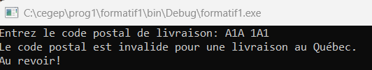
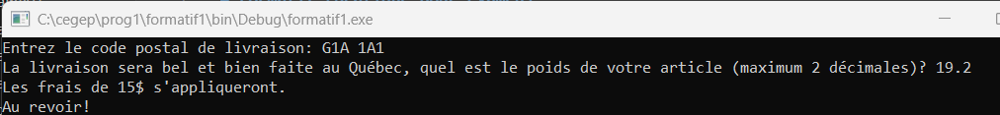

# Formatif (pratique pour examen)

- Ce formatif montre les divers types de questions et le niveau des questions pouvant se trouver dans un examen. 
- Dans l'examen, certaines questions demanderont de faire du code, d'autres de répondre sur une feuille ou en texte. 
- Vous devez être capable de créer un projet, y ajouter une feuille .cpp et l'enregistrer à un endroit particulier.
- Les exercices ci-dessous ne sont PAS SUFFISANTS pour être prêt à l'examen. Vous devez faire les exercices des semaines 1 à 4.

## Question 1 (théorique)

Voici quelques lignes de code. Il est demandé de donner la valeur de la variable nommée variableVolatile durant toutes les étapes de l'exécution pour les valeurs d'entrées fournies plus bas.

```cpp
1   int variableVolatile = 12;
2   int variableAutre = 0;
3 
4   cout << "Entrez un nombre entier quelconque:" << endl;
5   cin >> variableVolatile;
6
7   variableVolatile = variableVolatile - 6;
8   if (variableVolatile % 4 == 0) {
9 	    cout << "La variable volatile est divisible par 4" << endl;
10  }
11  else {
12	    variableVolatile = 3 * variableVolatile;
13	    variableAutre = variableVolatile - 1;
14	    cout << "variableVolatile + 3 vaut: " << variableVolatile + 3 << endl;
15	    cout << "variableAutre vaut: " << variableAutre << endl;
16	    cout << "donc, le contenu de variableVolatile est :" << variableVolatile << endl;
17
18  }
19
20  variableVolatile = 13;
21  variableVolatile = variableVolatile + 6;

```

Utilisez les entrées suivantes lors du cin:

a) l'utilisateur entre le chiffre 10 <br>
b) l'utilisateur entre le chiffre 20 <br>
c) l'utilisateur entre le chiffre 10.6 <br>

d) Pourquoi les lignes 20 et 21 ne sont pas `dynamiques`?


## Question 2 (pratique)
Écrire le code du petit programme qui calcule des rabais dans une caisse. Le code doit prendre en entrée le prix de l'article et le pourcentage de rabais (par exemple 20 pour signifier 20%) qu'il faut appliquer. Il faut aussi entrer si l'article est à prix régulier ou à prix déjà réduit. 

Si l'article est à prix régulier, on applique le rabais en entier. Sinon, on applique un plus petit rabais, c'est -à-dire la moitié du rabais pour article régulier. (Si on a un article à 100$ avec 20% de rabais et qu'on indique que c'est le prix régulier, on enlève 20% au prix. Si on indique que l'article est déjà à prix réduit, on lui enlève 10% (la moitié de 20%)).

Il faut afficher un message personnalisé qui dit le nom et le prix de l'article avant rabais et le prix de l'article après rabais ainsi que le pourcentage de rabais. Il peut aussi être indiqué si l'article est à prix réduit ou non.

Rappel: le rabais sur un article se calcule en faisant le   prix de l'article - prix de l'article * rabais / 100.


## Question 3 (théorique)

Expliquer en quelques mots vos réponses aux questions suivantes. Pour chaque question, les trois petits points indiquent que le code avant ou après n'a pas d'importance dans la réponse. Il ne s'agit pas d'erreurs de syntaxe, mais d'erreurs de logique.

a) Pourquoi l'expression suivante sera toujours fausse, peu importe la valeur de la variable? 

```cpp
char uneLettre;
...
...
cin >>uneLettre ;
...
if (uneLettre == 'M' && uneLettre == 'K' && uneLettre == 'P'){
    ...
}
```

b) Pourquoi le code suivant de vérifie PAS correctement que le nombre entré par l'utilisateur se situe bien entre 0 et 100? Que faudrait-il modifier pour que la vérification soit efficace?

```cpp
int monNombre;
...
...
cin >>mnoNombre;
...
if(monNombre > 0 || monNombre <100){
    cout << "le nombre n'est pas entre 0 et 100 ";
}
```

c) Y a-t-il une différence de résultat entre les 2 blocs de code suivants? 

code 1
```cpp
int monNombre;
...
...
cin >>monNombre;
...
if (monNombre >= 9) {
    cout << "couleur bleue" ;
} 
else if (monNombre < 18){
    cout << "couleur verte" ;
} 
```
code 2
```cpp
int monNombre;
...
...
cin >>monNombre;
...
if (monNombre >= 9) {
    cout << "couleur bleue" ;
} 
if (monNombre < 18){
    cout << "couleur verte" ;
} 
```

Proposez les valeurs à octroyer à monNombre pour tester toutes les possibilités. Pensez à des valeurs qui entrent dans les conditions, des valeurs qui n'y entre pas et des valeurs charnières (edge cases).


d) Dans quelles circonstances la phrase "Vous avez accepté" sera-t-elle affichée?

```cpp
string monTexte;
...
cin>> monTexte;
...
if (monTexte == "o" || "O" || "oui" || "Oui" || "OUI"){
	cout << "Vous avez accepté" << endl;
} 
...
```


## Question 4 (théorique)

Écrire le contraire des expressions suivantes de 2 manières différentes. a, b et c sont des variables entières (int)

```cpp
a > 4
b <= a + 6
a % 2 == 0
a != 5
c == a / b
a + b >= c
```

## Question 5 (pratique)

Concevoir et écrire un programme pour simuler un panneau d'affichage qui indique à un chauffeur à quelle vitesse il roule. On souhaite affecter à une variable la couleur des numéros sur le panneau.

Dans la rue où on met le panneau, la vitesse maximale est 40 km/h.

- Si la vitesse du conducteur est règlementaire (40 km/h ou moins), la couleur du signal lumineux est verte
- Si la vitesse du conducteur est légèrement au-dessus de la limite permise (5 km/h au-dessus maximum), la couleur du signal lumineux est jaune.
- Si la vitesse du conducteur est beaucoup au-dessus de la limite, la couleur du signal lumineux est rouge. Si la vitesse est de 30 km/h et plus au-dessus de la vitesse permise, le voyant lumineux clignote en plus d,être rouge.

Vous devez faire votre code en affectant la couleur à une variable et le fait que le signal clignote ou non dans une autre variable. SI DÉSIRÉ, faire un affichage (COUT) après la structure conditionnelle.

Je répète: MAXIMUM 1 cout.
Quelles valeurs utiliseriez-vous pour tester le code?
Quelle valeur pourrait affectée à une constante?


## Question 6

Vous devez valider un code postal entré par un utilisateur d'un service de livraison. L'utilisateur entre 2 informations:
- le code postal de la livraison
- le poids de son colis
lors de la validation, doit avoir l'indication si oui ou non, le code postal fourni est québécois. Les codes postaux alphanumériques au Canada sont de format A1A 1A1 et ceux du Québec commencent par G, H ou J. 

Il y a un frais de livraison de 15$ si le poids de l'article dépasse 30 kg.

Un message doit être donné à l'utilisateur lui indiquant:
- si oui ou non, il est éligible à la livraison (au Québec = éligible)
- si son colis aura un frais de 15$
- si l'une des entrées précédentes est invalide (pas le bon format, pas le bon type de variable)

Exemple:





Quels autres tests faudra-t-il faire pour explorer toutes les possibilités?