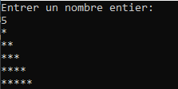
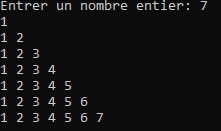

# Exercices boucle for

# Questions de compréhension

### Question 1

Qu'affiche le code suivant?

```cpp
for (int i = 0; i < 3; i++){
    cout << " i : " << i << endl;
}
```

### Question 2

Qu'affiche le code suivant?

```cpp
	for (int i = 0; i < 3; i++){
		cout << " i : " << i << "   ";
		for (int j = 0; j < 6; j++)	{
			cout << " j : " << j << " ";
		}
		cout << endl;
	}
```

# Questions de code

### Question 3
Calculer la factorielle d'un nombre. La factorielle d'un nombre entier positif est le produit de tous les entiers positifs inférieurs ou égaux à ce nombre. Elle est notée par un point d'exclamation après le nombre. Par exemple, la factorielle de 5 se note `5!`.

$$
n! = n \times (n-1) \times (n-2) \times ... \times 1
$$


### Question 4 

Pour les questions suivantes, faire le code qui nécessite de dessiner les formes suivantes. Faire chaque question en boucle simple et en boucle imbriquée.

### Exemple:

Faire apparaître ce dessin pour un nombre entier variable de symbole *.



1- Boucle simple:

```cpp
int nombre;

cout << "Entrer un nombre entier: " << endl;
cin >> nombre;
string ligne = ""; 

for (int i = 1; i <= nombre; i++) {
    ligne += "*"; 
    cout << ligne << endl;
}
```

2- Boucle imbriquée:

```cpp
int nombre;

cout << "Entrer un nombre entier: " << endl;
cin >> nombre;


for (int i = 1; i <= nombre; i++) {
    for (int j = 1; j <= i; j++) {
        cout << "*";
    }
    cout << endl;
}

```

## a) 
Faire le code pour reproduire l'image suivante, peu importe le nombre entré


Indice pour le faire avec une seule boucle:
```cpp
// Pour initialiser une chaine de *n* caractères identique, on utilise :
string ligne = string(n, '*')

//Pour retirer le dernier caractère d'une chaine, on utilise:

ligne.pop_back(); //nomDeVariable.pop_back()
```
Faites-le aussi avec boucle imbriquée

## b)

Faire le code pour reproduire l'image suivante, peu importe le nombre entré. Le faire avec une seule boucle et avec une boucle imbriquée.


## c)

Faire le code pour reproduire l'image suivante, peu importe le nombre entré. Le faire avec une seule boucle et avec une boucle imbriquée.



```cpp
//Pour transformer des nombres en chaine de caractères, on utilise to_string()

to_string(i)

```

## d)

Faire le code pour reproduire l'image suivante, peu importe le nombre entré. Le faire avec une seule boucle et avec une boucle imbriquée.


## e)

