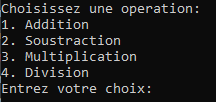
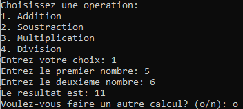
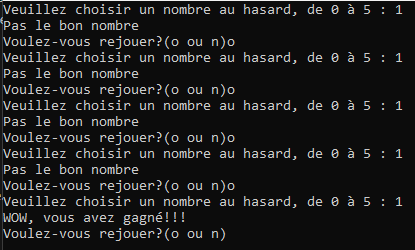
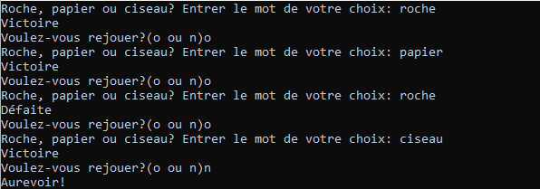

# Exercices do..while

Pour les exercices ci-dessous, 
- NE PAS utiliser de break. 
- NE PAS faire de return 0 pour terminer un if else ou une boucle


## Question 1

À l'aide de la boucle do..while, faire une mini-calculatrice à 2 nombres. Voici quelques étapes pour survoler la marche à suivre proposée:

- déclarer les variables ci-dessous: 
```cpp
char choix;
double num1, num2, resultat;
char continuer;
``` 
- Faites la boucle do..while dans laquelle on commence par présenter les options (voir image du texte à écrire, de "choisissez une opération à "entrer votre choix")



- Ensuite, demandez d'entrer les 2 nombres. 

- Toujours dans la boucle do..while, faites la structure `switch` pour guider le choix de l'utilisateur vers le bon traitement. Ne pas oublier le message pour l'entrée d'un choix invalide.

-  Selon le cas dans lequel vous codez, faire le calcul avec les nombres reçus et mettre le résultat dans la variable resultat. Afficher ensuite le contenu de la variable résultat. 

- Toujours dans la boucle, après la structure de switch, demandez à l'utilisateur s'il veut recommencer. il doit entrer O pour oui ou N pour non.


Voici une image d'un des comportements attendus:



- testez vos calculs. Ne pas oublier les cas limite! (positif, négatif, zéro...)

## Question 2

Faire les exercices 1 à 4 de la boucle `while`, mais en modifiant le code pour utiliser la boucle `do..while`.

## Question 3

Le tirage au sort! À l'aide de la boucle do..while, faites un programme qui demande un nombre à un usager, entre 0 et n, et qui dit à l'usager s'il a bien deviner le nombre aléatoire généré à chaque jeu.

Voici un exemple d'exécution:



## Question 4 

Roche papier ciseau.

À l'aide de la boucle do..while, faite un programme qui joue à Roche, papier, ciseau. Trouvez une façon d'utiliser la fonction de nombre aléatoire pour associer un nombre à un mot.

Exemple d'exécution



N'hésitez pas à le bonifier, à ajouter un "tableau du nombre de victoires" ou à afficher le choix aléatoire de l'ordinateur aussi!

## Question 5 (ajout le 1er octobre)
Devine le nombre!

Le programme doit piger un nombre secret aléatoire entre 1 et 100. Ensuite, le joueur à maximum 7 chances de deviner ce nombre. À chaque essai, le programme indique au joueur si son nombre est au-dessus, en-dessous ou s'il a deviné le nombre secret. Lorsque les chances sont écoulées, on indique au joueur qu'il a échoué, en lui montrant le nombre secret recherché. S'il a trouvé, on le félicite et on lui indique combien de coup ça lui a pris pour réussir.
 
On offre ensuite au joueur de rejouer (nouveau nombre secret avec 7 chances)

## Question 6 (ajout le 1er octobre, plus difficile (mais fun!))

Read my mind!

Cette fois-ci, c'est le programme qui doit essayer de deviner un nombre qu'on choisit dans notre tête. On choisi un nombre entre 1 et 100 et le programme me propose un nombre. Je dois ensuite lui indiquer s'il est au-dessus, en-dessous ou pile sur le nombre. Le programme pige ensuite un chiffre logique, comme le ferait un humain intelligent. Quelques options possibles pour faire choisir le nombre au programme, explorez le choix dichotomique (ou recherche binaire) https://www.khanacademy.org/computing/computer-science/algorithms/binary-search/a/binary-search 

Par exemple, 
- on a secrètement choisi dans notre tête le nombre 40. 
- Le programme propose 65. 
- on répond que c'est trop grand (répondre comme vous voulez)
- il va essayer un nombre entre 1 et 64. Il prend 12.
- on répond que c'est trop petit
- il va choisir un nombre entre 13 et 64
- ainsi de suite.


