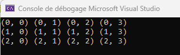

# La boucle `for`

Les boucles permettent d'exécuter un bloc de code plusieurs fois. En C++, il existe plusieurs types de boucles, dont la boucle for. La boucle for est utilisée lorsque vous savez à l'avance combien de fois une action doit être répétée.

## Syntaxe de base

```cpp
for (initialisation; condition; incrémentation) {
    // instructions à exécuter à chaque itération
}
```

- `Initialisation` : Cette section initialise une ou plusieurs variables avant que la boucle ne démarre (souvent un compteur).
- `Condition` : Tant que cette condition est vraie, la boucle continue de s'exécuter. Quand la condition devient fausse, la boucle s'arrête.
- `Incrémentation` : À chaque itération, cette étape est exécutée après le bloc de code. Elle permet de modifier la ou les variables du compteur, par exemple en les incrémentant.

## Exemple:

```cpp

for (int i = 1; i <= 5; i++) {
    cout << i << endl;
}

```

- `Initialisation` : int i = 1 initialise la variable i à 1.
- `Condition` : i <= 5 indique que tant que i est inférieur ou égal à 5, la boucle continuera.
- `Incrémentation` : i++ augmente la valeur de i de 1 à chaque itération. On peut aussi mettre `i +=2` ou autre quantité, si désiré.


`Note`: On utilise souvent le symbole strictement plus petit `<` au lieu de `<=` pour parcourir des tableau ou autres structures dont l'incrémentation commence à 0 et non à 1. Ainsi, si on veut faire 5 itérations en faisant commencer le `i` à 0, on peut aussi le faire ainsi:

```cpp

for (int i = 0; i < 5; i++) {
    cout << i << endl;
}

```

Tel qu'expliqué ici https://learn.microsoft.com/fr-fr/cpp/cpp/for-statement-cpp?view=msvc-170 , La variable qui sert de compteur peut être déclarée dans l'expression d'initialisation ou avant.

Cette variable s'appelle souvent `i` par convention, mais peut prendre n'importe quel autre nom, comme une variable.

On peut aussi décrémenter le compteur plutôt que de l'incrémenter:

```cpp
for (int i = 5; i >= 1; i--) {
    cout << i << endl;
}
```

## Utilisation à plusieurs variables

Il est possible d'utiliser plusieurs variables dans l'initialisation et l'incrémentation d'une boucle `for` :

```cpp
for (int i = 0, j = 10; i < j; i++, j--) {
    cout << "i: " << i << ", j: " << j << endl;
}
```


## Applications pratiques

Les boucles `for` sont très utilisées pour :

- Parcourir des tableaux ou des structures de données
- Répéter une action un nombre prédéterminé de fois
- Effectuer des calculs sur des séries de valeurs


## Exercice en classe

1. Écrivez un programme qui affiche les nombres de 10 à 1 en utilisant une boucle for. 

2. Ensuite, modifiez le programme pour afficher seulement les nombres impairs.

## Boucle for imbriquées
Il est possible de faire une boucle à l'intérieur d'une autre boucle. La syntaxe de base est:

```cpp
for (initialisation_externe; condition_externe; incrémentation_externe) {
    // instructions à exécuter dans la boucle externe
    for (initialisation_interne; condition_interne; incrémentation_interne) {
        // instructions à exécuter dans la boucle interne
    }
    // instructions à exécuter dans la boucle externe
}
```

## Exemple

```cpp
1. for (int i = 0; i < 3; i++) { // boucle externe
2.     for (int j = 0; j < 4; j++) { // boucle interne
3.         cout << "(" << i << ", " << j << ") ";
4.     }
5.     cout << endl; // aller à la ligne après chaque ligne de la boucle interne
6. }
```
Explication :
- Boucle externe : La boucle externe contrôle les lignes (index i), et elle itère 3 fois.
- Boucle interne : La boucle interne contrôle les colonnes (index j), et elle itère 4 fois à chaque passage de la boucle externe.
- Résultat : Le programme affiche une série de coordonnées (i, j) sur 3 lignes et 4 colonnes.



Faire la trace est TRÈS bénéfique pour comprendre le fonctionnement des boucles imbriquées:

|Ligne | i |   j | Affichage |
|-------| ----------- | ----------- |----------|
|1  | 0 |   |  |
|2  | 0 | 0 |  |
|3  | 0 | 0 |(0,0) |
|2  | 0 | 1 |  |
|3  | 0 | 1 |(0,0) (0,1)|
|2  | 0 | 2 |  |
|3  | 0 | 2 |(0,0) (0,1) (0,2) |
|2  | 0 | 3 |  |
|3  | 0 | 3 |(0,0) (0,1) (0,2) (0,3)|
|4  | 0 |   | Sortie de la boucle (j < 4)|
|5  | 0 |   | endl |
|1  | 1 |   |      |
|2  | 1 | 0 |      |
|3  | 1 | 0 |(1,0) |
|2  | 1 | 1 |      |
|3  | 1 | 1 |(1,0) (1,1)|
|2  | 1 | 2 |  |
|3  | 1 | 2 |(1,0) (1,1) (1,2) |
|2  | 1 | 3 |  |
|3  | 1 | 3 |(1,0) (1,1) (1,2) (1,3)|
|4  | 1 |   | Sortie de la boucle (j < 4)|
|5  | 1 |   | endl |
|1  | 2 |   |      |
|2  | 2 | 0 |      |
|3  | 2 | 0 |(2,0) |
|2  | 2 | 1 |  |
|3  | 2 | 1 |(2,0) (2,1)|
|2  | 2 | 2 |  |
|3  | 2 | 2 |(2,0) (2,1) (2,2) |
|2  | 2 | 3 |  |
|3  | 2 | 3 |(2,0) (2,1) (2,2) (2,3)|
|4  | 2 |   | Sortie de la boucle (j < 4)|
|5  | 2 |   | endl |
|6  |   |   | Sortie de la boucle (i < 3)|


# Résumé des 3 boucles

- La boucle `for`sert à faire des action un nombre déterminé et précis de fois (faire des calculs, parcourir une liste (on verra les tableau plus tard), etc.). Elle nécessite un compteur et tant que le compteur n'a pas atteint la limite, on refait les instructions dans la boucle. La boucle for peut être effectuée de 0 fois à l'infini (si la condition est mal posée)

- La boucle `while` peut être arrêtée dès qu'on a atteint une certaine condition, qu'on vérifie **au début** de la boucle. La condition peut être un compteur, mais peut aussi être une valeur clé de variable. La boucle while peut être effectuée de 0 fois à l'infini (si la condition est mal posée)

- La boucle `do..while` peut être arrêtée dès qu'on atteint une certaine condition, qu'on vérifie **à la fin** de la boucle.La condition peut être un compteur, mais peut aussi être une valeur clé de variable. La boucle do..while peut être effectuée de 1 fois à l'infini (si la condition est mal posée). C'est un bon choix de boucle pour faire des menus pour les utilisateurs.
