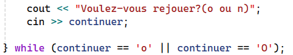
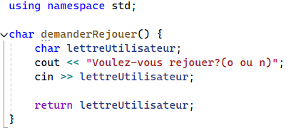
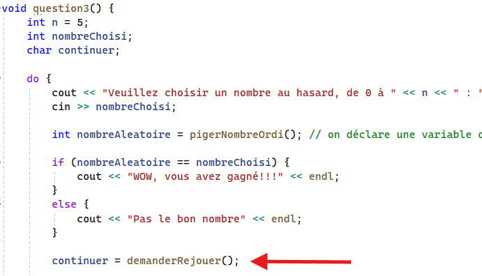
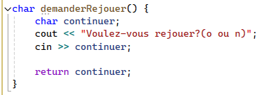
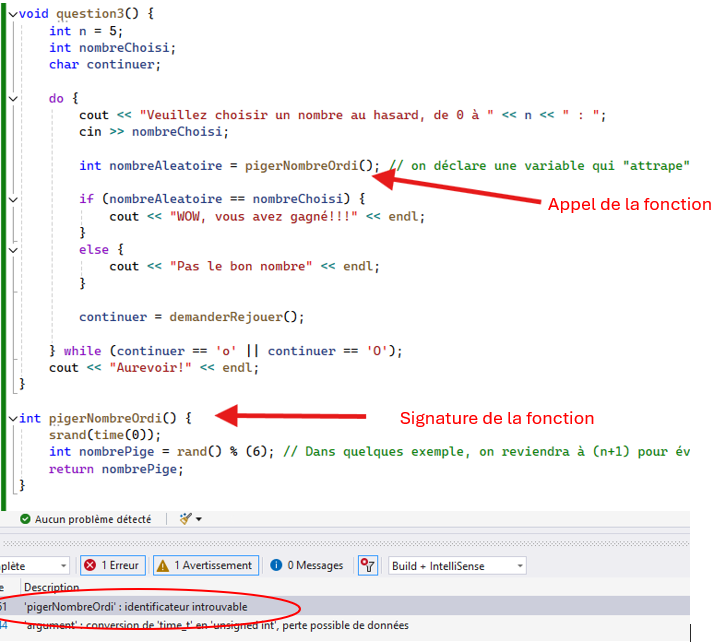

# Les fonctions

Une fonction est un nom que l’on donne à un groupe d’instructions. On peut alors placer ces instructions en dehors du main. Lorsqu’il faut exécuter ces instructions, on appelle la fonction par son nom et le programme va exécuter les instructions de la fonction et revient continuer son code à l'endroit où il était lors de l'appel de la fonction.

## Signature de fonction

La signature d'une fonction désigne l'ensemble des informations nécessaires pour identifier la fonction. Cela inclut :

- Le nom de la fonction
    - Peut contenir des lettres, chiffres et le caractère de soulignement _. 
    - Dans le cadre du cours, on continue avec le camelCase pour les noms de fonctions.
    - Ne peut pas commencer par un chiffre.
    - Sensible à la casse : fonctionA et fonctiona sont deux noms différents.
- Le type des paramètres (s'il y en a)
    - Placés dans les parenthèses de la définition de la fonction.
- Le type de retour 
    - Le type de retour est le type de la valeur que la fonction renvoie après son exécution. Si la fonction ne retourne rien, le type de retour est `void`. Les types sont les mêmes que pour les variables (`int`, `char`, `string`, une `struct`, etc.)
    - On ne peut pas retourner de tableau (on étudiera cette structure plus tard)
    - Un retour est une valeur ou un groupe de valeurs qui résulte du traitement dans la fonction.

## Définition de fonctions

```cpp
int obtenirNombre(){  // le int devant le nom de la fonction indique qu'on retournera un entier
    int monNombre = rand();  // instructions quelconques
    return monNombre; //mot clé return avec le contenu à retourner
}  


void afficherMessage(){  // le void indique qu'on fait un traitement sans retour
    cout << "On est dans une fonction"<<endl; // instructions quelconques
    cout << "plusieurs lignes de traitement possibles"<< endl;
}  //Pas de return

```

## Appel de fonction

Pour accéder au bloc de code dans la fonction, il faut appeler cette fonction. Pour se faire, il faut écrire le nom exact de la fonction suivi de parenthèses. Si la fonction n'a pas de paramètres, les parenthèses sont vides, sinon, les paramètres sont dans les parenthèses.

### Appel de fonction sans paramètres et *sans retour*

Lorsqu'on crée une application ou un programme, la fonction centrale est toujours le main(). Le main() sera lu ligne par ligne et les fonctions seront placées à l'extérieur, même dans des fichiers différents parfois. C'est le main() qui **appelle** les autres fonctions

```cpp
#include <iostream>
#include <clocale>
using namespace std;

//Définition de la fonction (avant le main())
void afficherMessage(){  
    cout << "On est dans une fonction"<< endl; 
    cout << "plusieurs lignes de traitement possibles"<< endl;
}


int main(){
    setlocale(LC_ALL, "");

    afficherMessage(); //appel de la fonction qui se distingue à cause des parenthèses
    
    return 0;
}
```

Dans l'exemple ci-haut, la fonction sera appelée, on ira faire les traitements dans la fonction appelée et on reviendra. 


## Exercice

Prendre le code ci-dessous et transférer le traitement dans une fonction nommée question3() qui n'a pas de retour et qui est appelée dans le main().

```cpp

#include <iostream>
#include <locale.h>
#include <cstdlib> 
#include <time.h> 

using namespace std;

int main() {
	setlocale(LC_ALL, "");

    //Question 3
	int n = 5;
	int nombreChoisi;
    char continuer;

	do {
		cout << "Veuillez choisir un nombre au hasard, de 0 à " << n << " : ";
		cin >> nombreChoisi;
		srand(time(0));
		int nombreAleatoire = rand() % (n+1);
		

		if (nombreAleatoire == nombreChoisi) {
			cout << "WOW, vous avez gagné!!!" << endl;
		}
		else {
			cout << "Pas le bon nombre" << endl;
		}

		cout << "Voulez-vous rejouer?(o ou n)";
		cin >> continuer;

	} while (continuer == 'o' || continuer == 'O');
	cout << "Aurevoir!" << endl;

}
```

> Il est intéressant de constater que rand() est elle même une fonction sans paramètres qui retourne un entier.


### Appel de fonction sans paramètres et *avec retour*

Si la fonction appelée a un retour (return), cela signifie que lorsqu'on l'appelle, elle effectue des traitements qui retournent une valeur ou une structure. 

UNE SEULE valeur peut être retournée dans une fonction en C++. Si on veut en retourner plus, il faudra une structure de données différente ou bien une autre approche (on verra plus tard).

```cpp
#include <iostream>
#include <clocale>
using namespace std;

//Définition de la fonction (avant le main())
int obtenirNombre(){  
    int monNombre = rand();  
    return monNombre; 
} 


int main(){
    setlocale(LC_ALL, "");

    int monNombre = obtenirNombre(); //appel de la fonction qui se distingue à cause des parenthèses
    
    return 0;
}
```

On distingue une différence majeure entre l'appel d'une fonction sans retour et l'appel d'une fonction avec retour. Lorsqu'il y a un retour dans la fonction appelée, on peut avoir besoin de la garder en mémoire quelque part pour utiliser sa valeur dans d'autres traitements. Reprenons l'exemple de la question 3. Disons qu'on veuille bien diviser les tâches et les mettre les sous-traitements dans des fonctions. 

## Exemple

1. faire une fonction pigerNombreOrdi() qui retourne un entier de 0 à 5:

```cpp

int pigerNombreOrdi() {
	srand(time(0));
	int nombrePige = rand() % (6); // Dans quelques exemple, on reviendra à (n+1) pour éviter de hardcoder
	return nombrePige;
}

void question3() {
	int n = 5;
	int nombreChoisi;
	char continuer;

	do {
		cout << "Veuillez choisir un nombre au hasard, de 0 à " << n << " : ";
		cin >> nombreChoisi;

        int nombreAleatoire = pigerNombreOrdi(); // on déclare une variable qui "attrape" le retour du traitement dans la fonction pigerNombreOrdi().


		if (nombreAleatoire == nombreChoisi) {
			cout << "WOW, vous avez gagné!!!" << endl;
		}
		else {
			cout << "Pas le bon nombre" << endl;
		}

		cout << "Voulez-vous rejouer?(o ou n)";
		cin >> continuer;

	} while (continuer == 'o' || continuer == 'O');
	cout << "Aurevoir!" << endl;
}

int main() {
    ...
}
```

2. On souhaite transférer le processus de demande de rejoute dans une fonction. On transformera le bout de code ci-dessous: <br>


La fonction s'appellera demanderRejouer() et retournera la lettre entrée par l'utilisateur. Voici les 2 changements que cela apportera:

 <br>




## Informations importante à savoir sur les fonctions en C++

- L'appel d'une fonction est suivie directement d'une paire de parenthèses, vide ou non.

- Par convention, on nomme les fonctions avec des verbes d'action. Par exemple: 
	- calculerSomme( )  -  (en anglais calculateSum( ))
	- afficherResultat( )   -   (en anglais displayMenu( ))
	- lireFichier( )  -    (en anglais readFile( ))
	- verifierMotDePasse( )  -    (en anglais checkPassword( ))
	- estValide( ) 	- 	(en anglais isValid( ))

- On continue d'utiliser la nomenclature de type camelCase pour nommer les fonctions. Des noms significatifs de fonctions doivent toujours être choisis. Les noms anglais sont plus répandus, mais les 2 langues (français et anglais) sont acceptées dans ce cours, tant qu'il y a une uniformité dans le travail.

- Les fonctions sont déclarées à l'EXTÉRIEUR du main(), AVANT celui-ci.

- Le main() est toujours le point de départ d'un programme, aussi gros soit-il. 

- On peut appeler des fonctions dans d'autres fonctions, sans limite d'imbrication.

- Le nom de la variable dans la fonction peut être le même ou être différent du nom de la variable déclarée dans un autre environnement. Par exemple:



- Une fonction doit être déclarée (minimalement sa signature) AVANT d'être appelée. Ne pas faire ceci:



