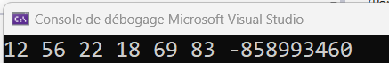

# Les tableaux

**Définition** : Un tableau est une structure de données, un conteneur, qui permet de stocker plusieurs valeurs du même type de façon consécutive en mémoire. On peut y accéder en connaissant le nom du tableau et la position de l'élément auquel vous voulez accéder. Pour le déclarer, on doit connaître la taille du tableau (combien d'éléments on veut mettre dedans) et le type des éléments qu'on y mettra.

```cpp
int notes[5] = {90, 85, 70, 88, 95};
```

Pour accéder ou remplacer une valeur dans un tableau, on doit spécifier le nom du tableau suivi de l'indice (index) de cet élément:

```cpp
cout << "La valeur du tableau notes à l'indice 2 est: "<< notes[2];
note[2] = 75; //On écrase la valeur
cout << "La nouvelle valeur du tableau notes à l'indice 2 est: "<< notes[2];
```

Pour parcourir toutes les valeurs d'un tableau, on utilise une boucle. Puisque la taille d'un tableau est fixe, la boucle `for` est pratique.

```cpp
int monTableau[6] = { 12,56,22,18,69,83 };

//afficher chaque élément du tableau
for (int i = 0; i < 6; i++) {
    cout << monTableau[i] << " ";
}
```
**Attention!** Il ne faut pas aller à l'extérieur du tableau définit si on ne veut pas de mauvaises surprises:

```cpp
//Ne pas faire
for (int i = 0; i < 7; i++) {
    cout << monTableau[i] << " ";
}
```
Résultat: <br>




# Assigner ou changer une valeur

Pour assigner une valeur, il faut utiliser le nom du tableau et l'indice comme un tout qui représente la "variable". Pour remplacer la valeur 22 par 25 dans monTableau, je dois faire:

```cpp
monTableau[2] = 25;  // 25 écrase la valeur dans le tableau à l'indice 2 (3e place)
```

# Taille d'un tableau

On peut obtenir la taille (capacité totale et non cases remplies) d'un tableau en faisant ceci (ne fonctionne pas si le tableau est un pointeur (on verra plus tard)):

```cpp
for (int i = 0; i < size(monTableau); i++){
    cout << monTableau[i];
}
```

Il est aussi possible de faire ceci manuellement pour les versions moins récentes de C++ ou quand on passera le tableau en paramètre à une fonction:

```cpp
int taille = sizeof(monTableau) / sizeof(monTableau[0]);

for (int i = 0; i < taille; i++){
    cout << monTableau[i];
}
```

Autre notation (*for-each*) (Seulement si on n'a pas besoin de l'indice de chaque élément):

```cpp
int mesNombres[5] = {10, 20, 30, 40, 50};
for (int n : mesNombres) {
  cout << n << endl;
}
```


### Exemple 1

Remplir un tableau de taille 7 avec des valeurs que l'utilisateur fournit. Parcourir le tableau et trouver le maximum et le minimum. Afficher-les à la fin. 

Le code a été placé dans une fonction nommée maxEtMin() et appelée du main()

```cpp
void maxEtMin() {
	int merveilleuxTableau[7];
	int taille = sizeof(merveilleuxTableau) / sizeof(merveilleuxTableau[0]);
	for (int i = 0; i < taille; i++) {
		cout << "Entrer la valeur #" << i << " du tableau: ";
		cin >> merveilleuxTableau[i];
		cout << endl;
	}
	int maximum = INT_MIN;
	int minimum = INT_MAX;

	for (int i = 0; i < taille; i++) {
		if (merveilleuxTableau[i] < minimum) {
			minimum = merveilleuxTableau[i];
		}

		if (merveilleuxTableau[i] > maximum) {
			maximum = merveilleuxTableau[i];
		}
	}
	cout << "Le minimum est: " << minimum << endl;
	cout << "Le maximum est: " << maximum << endl;
}

int main(){
	maxEtMin();
	return 0;
}
```

### Exercice 1

Mettre les valeurs suivantes dans un tableau et trouver le nombre de lettres 'A' ou 'a' qui s'y trouvent

```cpp
{ 'A', 'n', 'G', 'b', 'd', 'A', 'M', 'x', 'I', 'p', 'C', 'L', 'z', 'h', 'O', 'K', 'j', 'T', 'S', 'a','f', 'W', 'Y', 'l', 'r', 'U', 'C', 'v', 'Q', 'm', 'B', 'e', 'd', 'I', 'k', 'P', 'N', 'f', 'a', 'o' };
```
### Solution

```cpp
void trouverLettreA() {
	//on n'est pas obligé de mettre la taille du tableau si on initialise le tableau avec les éléments
	char monTableau[] = { 'A', 'n', 'G', 'b', 'd', 'A', 'M', 'x', 'I', 'p', 'C', 'L', 'z', 'h', 'O', 'K', 'j', 'T', 'S', 'a','f', 'W', 'Y', 'l', 'r', 'U', 'C', 'v', 'Q', 'm', 'B', 'e', 'd', 'I', 'k', 'P', 'N', 'f', 'a', 'o' };
	int compteurDeA = 0;
	int taille = size(monTableau);
	for (int i = 0; i < taille; i++) {
		if (monTableau[i] == 'a' || monTableau[i] == 'A') {
			compteurDeA = compteurDeA + 1;
		}
	}
	cout << "Dans ce tableau, il y a " << compteurDeA << " fois la lettre A ou a" << endl;

}
```

### Exemple 2

Les chaînes de caractères (string) se traitent aussi comme des tableaux. On peux aussi prendre la fonctionnalité .size() pour obtenir la taille de la chaîne de caractères. Ici, le code inverse une chaîne de caractères:

```cpp
void exemple2(){
    string texte, inverse = "";

    cout << "Entrez une chaîne de caractères : ";
    getline(std::cin, texte); //comme un cin, mais qui gère les espaces

    for (int i = texte.size() - 1; i >= 0; i--) {
        inverse += texte[i];
    }

    cout << "Chaîne inversée : " << inverse << "\n";
}

```

