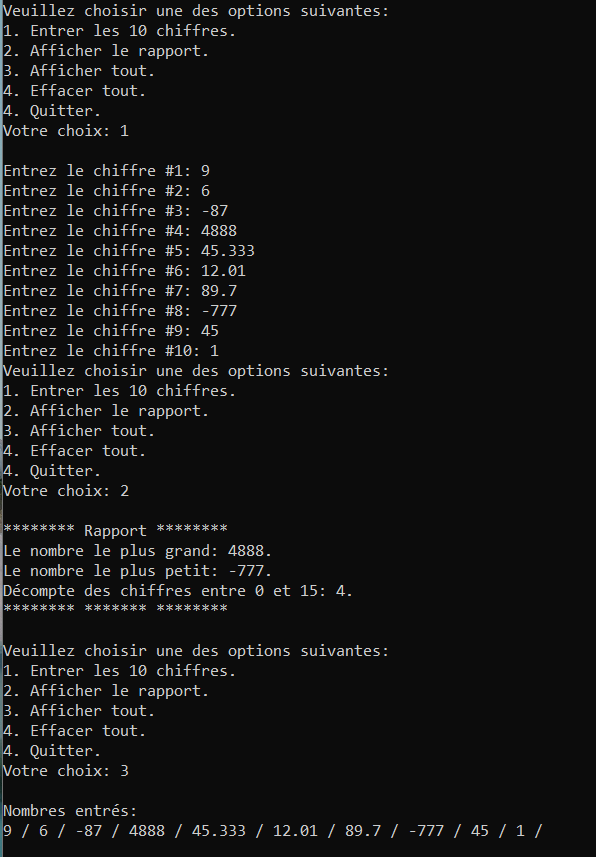

# Formatif (entraînement pour examen 2)

- Ce formatif montre les divers types de questions et le niveau des questions pouvant se trouver dans l'examen 2. 
- Dans l'examen 2, certaines questions demanderont de faire du code, d'autres de répondre sur une feuille ou en commentaire. 
- Vous devez être capable de créer un projet, y ajouter une feuille .cpp et l'enregistrer à un endroit particulier.
- Les exercices ci-dessous ne sont PAS SUFFISANTS pour être prêt à l'examen. Vous devez faire les exercices depuis la semaine 6. La matière vue avant peut aussi se trouver à l'examen (structure de if, opérateurs booléens, déclaration de variable, nomenclature).
- Le type de boucle à utiliser dans votre code n'est jamais imposé. toutefois, certains choix sont plus judicieux que d'autres et le break et le while(true) ne sont pas permis.

## Question 1

Dans une fonction nommée question1():
- Faire 5 fois le traitement suivant:
    - Demander un nombre entier à l'utilisateur. Si le nombre n'est pas entre 10 et 50, lui mettre un message d'erreur et lui redemander un nombre.
    - Après avoir demandé et obtenu les 5 nombres valides, conserver le nombre le plus grand et l'afficher.

Important: le code doit être dynamique et s'adapter rapidement à un autre nombre de demandes.


## Question 2

a) Est-ce que le nombre de tours de passages dans la boucle sera différent dans les 2 boucles suivantes? Pourquoi?

```cpp
for (int i = 0; i < 8; i++){
    //instructions quelconques
}

for (int i = 1; i < 9; i++){
    //instructions quelconques
}
```
b) Si on a un tableau de taille 8, est-ce que les 2 boucles ci-haut peuvent être utilisées pour parcourir le tableau sans modifier la structure des boucles? Donnez des exemple en code.


## Question 3

Situation : Faire un menu qui offre des options dans le but de faire remplir un nombre de nombres à un utilisateur pour en faire ces choses:

- OPTION 1: lui faire entrer les 10 chiffres
- OPTION 2: afficher un rapport: 
    - le plus petit nombre entré
    - le plus grand
    - le nombre de chiffres entre 0 et 15
- OPTION 3: afficher la liste des nombres entrés.
- OPTION 4: effacer tout, pour être prêt à entrer 10 nouveaux nombres.

Détails:

- L’utilisateur voit le numéro de la question à laquelle il est rendu à chaque question.
- Tous les nombres sont acceptés en entrée (négatifs, positifs, zéro)
- Si vous utilisez DBL_MIN et DBL_MAX, il faut importer la librairie <cfloat>

Exemple:



## Question 4 

Dans le code ci-dessous, Remplacer les ... dans le while pour que la boucle fasse son travail.

```cpp
	float prix;
	cout << "Veuillez entrer le prix d'un article: ";
	cin >> prix;
	while (   ...   ) {
		cout << "Erreur, le prix doit être positif, veuillez recommencer:";
		cin >> prix;
		if (prix >= 0) {
			cout << "Merci d'avoir corrigé le prix!";
		}
	}
```

Autres questions à venir!


