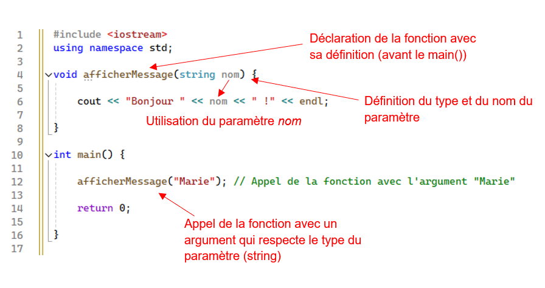

# Les fonctions avec paramètres

Dans une fonction, un paramètre est une variable que la fonction utilise pour recevoir des valeurs lors de son appel. Ces valeurs, appelées `arguments`, sont passées à la fonction depuis l'extérieur pour que celle-ci puisse les utiliser pour effectuer ses instructions.

# Passage par *valeurs*

## Exemple

La fonction *afficherMessage* ci-dessous ne retourne rien (void) et prend un paramètre de type string pour faire ses instructions.

```cpp
#include <iostream>
using namespace std;

void afficherMessage(string nom) {
    cout << "Bonjour " << nom << " !" << endl;
}

int main() {
    afficherMessage("Marie"); // Appel de la fonction avec l'argument "Marie"
    return 0;
}
```

 <br>


Il est possible d'avoir plusieurs paramètres définit dans une fonction. Il faut définir leurs types respectifs séparés par une virgule. Ici, on a une fonction nommée *somme* qui a comme paramètre un entier et un float et qui retourne un float.

```cpp
#include <iostream>
using namespace std;

float somme(int nombre1, float nombre2) {
    float resultat = nombre1 + nombre2;
    return resultat;
}

int main() {
    float doubleSomme = somme(3, 5.0)*2;
    cout << doubleSomme;
    return 0;

}
```

## Exercice

Modifier le code ci-dessous pour passer la variable *n* en paramètre à la fonction pigerNombreOrdi(). N'oubliez pas de l'inclure dans les calculs!

```cpp
int pigerNombreOrdi() {
	srand(time(0));
	int nombrePige = rand() % (6); 
	return nombrePige;
}

void question3() {
	int n = 5;
	int nombreChoisi;
	char continuer;

	do {
		cout << "Veuillez choisir un nombre au hasard, de 0 à " << n << " : ";
		cin >> nombreChoisi;

        int nombreAleatoire = pigerNombreOrdi(); 

		if (nombreAleatoire == nombreChoisi) {
			cout << "WOW, vous avez gagné!!!" << endl;
		}
		else {
			cout << "Pas le bon nombre" << endl;
		}

		cout << "Voulez-vous rejouer?(o ou n)";
		cin >> continuer;

	} while (continuer == 'o' || continuer == 'O');
	cout << "Aurevoir!" << endl;
}

int main() {
    ...
}
```

## Exercice

Vérification de code postale

Dans le main, demandez un code postal à l'utilisateur. Stockez le résultat dans une chaine de caractère (string).

On passe ensuite le résultat à une fonction nommée `verifierCodePostal` qui prend en paramètre le code et qui retourne vrai ou faux, selon si le code est valide.

Pour valider un code postal, il faut que le format respecte l'alternance lettre-chiffre-lettre-espace-lettre-chiffre-lettre. Selon le retour de la fonction dans le `main`, informer l'utilisateur que son code est valide ou non. Lui demander de recommencer tant que ça n'est pas valide.

Truc: si on a une chaîne de caractères nommée `maChaine`, pour accéder au premier élément de cette chaîne, on fait `maChaine[0]` pour le premier élément, `maChaine[1]` pour le 2e, `maChaine[2]` pour le 3e, etc. Pour savoir si un caractère est un nombre, on mets isdigit(...), qui retourne vrai si c'est un nombre. Pour les lettre, on utilise isalpha(...). Pour la longueur de la chaine, on fait maChaine.length(). Il faut la librairie string d'inclus.

## Solution à l'exercice

```cpp
#include <iostream>
#include <string>
using namespace std;

bool verifierCodePostal(string code) { // porter attention au paramètre, je ne demande pas de comprendre les crochets
	bool reponse = false;
	if (isalpha(code[0]) && isdigit(code[1]) && isalpha(code[2]) && code[3] == ' ' && isdigit(code[4]) && isalpha(code[5]) && isdigit(code[6])) {
		reponse = true;
	}
	return reponse;
}

int main() {
	
	string codePostal;
	cout << "Entrer un code postal: ";
	getline(cin,codePostal); //getline pour prendre les espaces


	bool codeValide = verifierCodePostal(codePostal); //appel à la fonction qui retournera vrai ou faux
}

```

# À savoir...

- Ce qu'on a fait ci-haut, c'est de passer des paramètres par *valeur*. Les paramètres sont donc des variables qui copient les arguments passés et dont la portée est la fonction seulement. 

- Il est possible de mettre des paramètres **par défaut**, au cas où un paramètre est manquant.

- Si on veut retourner un résultat, on ne peut retourner qu'une seule valeur à la fois. Si on souhaite modifier plusieurs variables avec une fonction, on peut utiliser des structures de données (tableau, vecteur, autre) ou bien utiliser le passage par référence.


# Passage par *référence*

Le passage par référence permet à une fonction de modifier la valeur d'une variable passée en paramètre. Au lieu de copier la valeur du paramètre, la fonction reçoit une "référence" à la variable originale, ce qui lui permet de travailler directement dessus, de l'utiliser, mais aussi de la **modifier**.

Pour passer un paramètre par référence, il suffit d'ajouter le symbole & (éperluette) entre le type du paramètre et son nom dans la déclaration de la fonction.

Exemple simple:

```cpp
#include <iostream>
using namespace std;
void doubler(int& nombre) {
    nombre = nombre * 2;  // Double la valeur de 'nombre', mais ne retourne rien... 
}

int main() {
    int valeur = 5;
    cout << "Avant : " << valeur << endl;
    
    doubler(valeur);  // Appel de la fonction, 'valeur' est passé par référence
    
    cout << "Après : " << valeur << endl;  // La valeur est maintenant 10
    return 0;
}
```

# Exercices


## 1.Quel type de fonction utiliser?

Dans le code ci-dessous, on souhaite encapsuler le traitement de l'attribution du message de réussite ou d'échec à une ou plusieurs fonctions. Est-ce qu'on prend une fonction avec ou sans paramètres (passage par référence ou par valeur?)? Avec return ou pas? 

```cpp
cout << "Veuillez entrer le nom de l'étudiant" << endl;
cin >> nomEtudiant;

cout << "Veuillez entrez la note de l'examen 1" << endl;
cin >> noteExamen1;

cout << "Veuillez entrez la note de l'examen 2" << endl;
cin >> noteExamen2;

cout << "Veuillez entrez la note du TP" << endl;
cin >> noteTP;

moyennePonderee = noteExamen1 * 0.35 + noteExamen2 * 0.4 + noteTP * 0.25;

if (moyennePonderee > 0 && moyennePonderee < 60 ) {
	message = "un échec";
}
else if (noteExamen1 < 60 || noteExamen2 < 60 || noteTP < 60) {
	message = "une réussite partielle";
}
else {
	message = "une réussite totale";
}

cout << "L'étudiant " << nomEtudiant << " a eu la note de " << moyennePonderee << ". Il a donc " << message << endl;

```

## Solution (autres possibilités pour les paramètres):

```cpp
#include <iostream>
#include <clocale>
using namespace std;

float calculerMoyennePonderee(float note1, float note2, float noteTP) {
    float moy = note1 * 0.35 + note2 * 0.4 + noteTP * 0.25;
    return moy;
}

void demanderNomEtudiant(string& nom) {
    cout << "Veuillez entrer le nom de l'étudiant" << endl;
    cin >> nom;
}

void demanderNoteExamen(float& note) {
    cout << "Veuillez entrez la note de l'examen" << endl;
    cin >> note;
}

string obtenirMessageReussite(float moyenne, float note1, float note2, float noteTP) {
    string message;
    if (moyenne > 0 && moyenne < 60) {
        message = "un échec";
    }
    else if (note1 < 60 || note2 < 60 || noteTP < 60) {
        message = "une réussite partielle";
    }
    else {
        message = "une réussite totale";
    }
    return message;
}

void quelTypeUtiliser() {
    float moyennePonderee;
    float noteExamen1;
    float noteExamen2;
    float noteTP;
    string nomEtudiant;
    string message;

    demanderNomEtudiant(nomEtudiant);
    demanderNoteExamen(noteExamen1);
    demanderNoteExamen(noteExamen2);//réutiliser la même fonction, mais changer une note différente

    cout << "Veuillez entrez la note du TP" << endl;
    cin >> noteTP;

    moyennePonderee = calculerMoyennePonderee(noteExamen1, noteExamen2, noteTP);
    message = obtenirMessageReussite(moyennePonderee, noteExamen1, noteExamen2, noteTP);

    cout << "L'étudiant " << nomEtudiant << " a eu la note de " << moyennePonderee << ". Il a donc " << message << endl;

}

int main() {
    setlocale(LC_ALL, "");
    quelTypeUtiliser();
    return 0;
}
```

## 2. Faire une fonction avec passage des valeurs en paramètres.

Dans le main, on pose une question à répétition à un utilisateur pour qu'il entre un nombre. on a également une fonction qui prend ce nombre et le nombre maximal et qui modifie le plus grand nombre si l'utilisateur a entré un nombre plus grand. Voici du code qui serait dans une fonction quelconque, disons dans la fonction jeuDuMax();

```cpp

char choix;
int nombre;
int lePlusGrand=-1;
do {
	cout << "Entrer un nombre: ";
	cin >> nombre;


    
	cout << "Le nombre le plus grand est: " << lePlusGrand << endl;
	cout << "voulez-vous continuer (o ou n)";
	cin >> choix;
} while (choix != 'n');

```
Modifier et bonifier ce code pour y mettre une fonction avec passage par référence pour modifier le max si nécessaire, en comparant le nombre entré avec le plus grand nombre.
